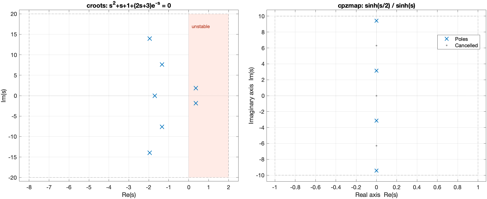

# ContourRoots

**Poles, zeros and roots of nonrational functions in MATLAB.**

ContourRoots finds the roots of scalar analytic functions, and the poles
and zeros of scalar transfer functions, inside a rectangle of the complex
plane. It is meant for functions that are **not** ratios of polynomials:
characteristic equations with time delays ($e^{-sT}$), transfer functions
of heat, wave, duct and beam models ($\sinh$, $\cosh$, $\sqrt{s}$, ...), and
anything else you can write as a MATLAB function.

- The function is evaluated **as you give it**: no Padé approximation, no
  truncation to a finite number of modes.
- The **argument principle** counts how many roots each part of the
  rectangle contains, so the result tells you whether every root was found.
- Pole-zero **cancellations** are detected, so `cpoles` returns the poles
  that really appear in the input/output behavior.
- The interface mirrors MATLAB's `roots`, `pole`, `zero` and `pzmap`, and
  `cstep`, `cimpulse` and `clsim` compute time responses from the same
  nonrational $G(s)$, like `step`, `impulse` and `lsim`.



## Installation (no git needed)

ContourRoots is plain MATLAB code. It was tested on MATLAB R2023b; the
core functions need no additional toolbox. Choose one of these options.

**Option 1: Add-On installer (easiest).**
Download [`ContourRoots.mltbx`](https://github.com/flavioluiz/ContourRoots/releases/latest/download/ContourRoots.mltbx)
from the [Releases page](https://github.com/flavioluiz/ContourRoots/releases/latest)
and double-click it, or open it from the MATLAB *Current Folder* browser.
MATLAB installs it like any Add-On, and it stays available in future
sessions. To remove it, use *Home > Add-Ons > Manage Add-Ons*.

**Option 2: from the MATLAB Command Window.**
Paste these three lines. They download the latest release into a folder
named `ContourRoots` inside your current folder and add it to the path:

<!-- no-test -->
```matlab
url = "https://github.com/flavioluiz/ContourRoots/releases/latest/download/ContourRoots.zip";
unzip(websave("ContourRoots.zip", url), "ContourRoots");
run("ContourRoots/setup_contourroots.m")
```

**Option 3: ZIP file by hand.**
Download [`ContourRoots.zip`](https://github.com/flavioluiz/ContourRoots/releases/latest/download/ContourRoots.zip),
unzip it anywhere, open the folder in MATLAB and run `setup_contourroots`
(or type `run("path/to/ContourRoots/setup_contourroots.m")` from any folder).

With options 2 and 3, the path change lasts until MATLAB is closed. To keep
it, type `savepath` afterwards, or run `setup_contourroots` again in each
session. Check the installation with:

```matlab
contourroots      % prints the version and the main functions
```

Version 0.9.0 adds opt-in shared-grid MIMO kernel preparation:
`ckernel(M,t,'SharedGrid',true,...)` evaluates the whole transfer matrix at
common FFT/de Hoog nodes, using one factorization and all right-hand sides
for `cdyn`. Per-output tolerances and per-channel delays/direct terms are
preserved. See the [benchmark and usage notes](docs/benchmarks/shared_grid_preparation.md).

## Your first roots in 30 seconds

The characteristic equation of a system with a delay,
$F(s) = s^2 + s + 1 + (2s+3)\,e^{-s} = 0$, has infinitely many roots.
Ask for those in the rectangle $-8 < \mathrm{Re}\,s < 2$,
$-20 < \mathrm{Im}\,s < 20$:

```matlab
F = @(s) s.^2 + s + 1 + (2*s + 3).*exp(-s);
region = [-8 2 -20 20];                    % [xmin xmax ymin ymax]
[r,info] = croots(F, region, 'AssumeAnalytic', true)
```

`r` holds 7 roots, rightmost first. The first two, $0.362 \pm 1.820i$,
have positive real part: the system is unstable. `info.status` is
`'numerically_complete'`: the contour counts account for every root in the
rectangle.

`'AssumeAnalytic',true` is your statement that `F` has no poles, branch
cuts or other singularities near the rectangle. It is true here, because
`F` is made of polynomials and `exp`. MATLAB cannot check this for an
arbitrary function handle; without it the search still runs, but in an
*exploratory* mode that cannot confirm completeness (and `croots` warns you).

`croots` also accepts polynomial coefficients, exactly like `roots`:

```matlab
croots([1 0 -1], [-2 2 -1 1])              % roots of s^2 - 1
```

## Poles and zeros of a transfer function

Give the numerator and the denominator separately with `ndpair`. Keeping
them separate is what allows ContourRoots to count poles and zeros and to
detect cancellations:

```matlab
G = ndpair(@(s) sinh(s/2), @(s) sinh(s));  % G(s) = sinh(s/2)/sinh(s)
p = cpoles(G, [-1 1 -10 10], 'AssumeAnalytic', true)
z = czeros(G, [-1 1 -10 10], 'AssumeAnalytic', true)
cpzmap(G, [-1 1 -10 10], 'AssumeAnalytic', true)
```

$\sinh(s)$ vanishes at $s = i\pi k$ for every integer $k$, but when $k$ is
even $\sinh(s/2)$ vanishes too and the pole cancels. `cpoles` returns only
$\pm i\pi$ and $\pm 3i\pi$, and `z` is empty; `cpzmap` shows the cancelled
points as grey dots.

## Reading the results

| Output | Meaning |
|---|---|
| `r`, `p`, `z` | Locations (column vector), rightmost first. A multiple root appears once. |
| `info.status` | `'numerically_complete'`, `'unresolved'` or `'exploratory'` |
| `info.complete` | `true` when the contour counts match the roots returned |
| `info.multiplicity` | Multiplicity of each location |
| `info.residuals` | $\lvert F\rvert$ (or $\lvert D\rvert$ for poles) at each location |
| `info.cancelledLocations` | Candidates where pole-zero cancellation occurred (`info.cancellationComplete`: removed entirely or not) |
| `info.unresolvedBoxes` | Parts of the rectangle that could not be resolved |

"Numerically complete" means: if the function is analytic as declared, and
the contours are sampled finely enough, then every root inside the
rectangle was found. It is a careful numerical check, **not** a mathematical
proof, and it says nothing about roots outside the rectangle.

## Beyond root finding: time-delay systems

For $D(s) + N(s)e^{-sT} = 0$ with polynomials $D$ and $N$, ContourRoots
also computes every delay at which the stability can change, without
approximating the delay:

```matlab
crit = critical_delays(2, [1 1], 10)   % s + 1 + 2 e^{-sT} = 0, 0 <= T <= 10
Z = unstable_root_count(2, [1 1], 1.5) % 2 roots with Re(s) > 0 at T = 1.5
```

The [time-delay tutorial](docs/tutorials/05_time_delay_systems.md) explains
these tools, and the [Padé tutorial](docs/tutorials/06_pade_pitfalls.md)
shows how a Padé approximation of the delay can lead to wrong stability
conclusions. The same approach gives the
[flutter speed of a wing section](docs/tutorials/09_aeroelasticity.md) with
exact Theodorsen aerodynamics, without rational approximations.

## A continuous wing: flutter with nothing discretized

The same idea scales to a flexible wing. The Goland wing is a cantilever
beam that bends and twists, with exact Theodorsen air loads on every
spanwise strip. Its modes are the zeros of $\Delta(s,U) = \det K(s,U)$,
built from the *exact* solution of the beam equations along the span. There
are **no finite elements, no modal truncation and no rational fit of the
aerodynamics**. Stability is a root count in the right half-plane:

```matlab
addpath(fullfile(fileparts(fileparts(which('croots'))), 'examples', 'models'))
wing = wing_model('goland');           % continuous beam + exact Theodorsen strips
p = croots(@(s) wing_delta(s, 150, wing), [1e-3 60 -400 400], 'AssumeAnalytic', true)
% p = 3.70 +/- 68.18i: at 150 m/s one pair is unstable (flutter)
```


The flutter speed, 136.984 m/s, is the limit that a finite-element model
approaches as its mesh is refined.
[Tutorial 11](docs/tutorials/11_continuous_wing.md) derives the model,
checks it against closed-form beam frequencies and an independent
finite-element model, and computes time responses of the wing tip.

## Time responses without rational approximation

`step`, `impulse` and `lsim` need a state-space model, which a transfer
function with a delay, a diffusion term or unsteady aerodynamics does not
have. `cstep`, `cimpulse` and `clsim` compute the same responses directly
from $G(s)$, by numerically inverting the Laplace transform — no Padé or
modal approximation, and with convergence checks:

```matlab
G = @(s) 1./(s + 1 + 0.5*exp(-s));         % loop with a delay
t = (0:0.05:6).';
[y, t, info] = cstep(G, t, 'SingularityBound', 0);
info.status                                % 'converged'
```

`'SingularityBound',0` states that $G$ has no singularity with
$\mathrm{Re}\,s > 0$ (true here, since $|s+1| \ge 1 > 0.5$ in that
half-plane); for rational and `tf` models it is found automatically. All
responses start from rest. See [Tutorial 10](docs/tutorials/10_time_response.md)
for forced responses, impulses, unstable systems and the pitch response
of the aeroelastic section.

To simulate many inputs on the same system (a sine sweep, a set of
reference signals), prepare the kernels once with
[`ckernel`](docs/api/ckernel.md) and pass the result to `clsim` in place
of `G`: `K = ckernel(G,t,...); y = clsim(K,u,t)`. No inverse transform is
repeated, and each input still gets its own accuracy check
([Tutorial 10, Section 10.5.1](docs/tutorials/10_time_response.md#1051-several-inputs-one-preparation)).

**Several inputs and outputs.** The same functions accept matrix models:
`cmimo` builds a transfer matrix and `cdyn` a structured model
$G = C\,H(s)^{-1}B + D$. For example, `clsim` then gives the response of
the continuous wing to a tip force and a tip torque applied together
([Tutorial 12](docs/tutorials/12_hybrid_mimo.md), which also builds the
wing from connected parts).

**Modes of a matrix.** `cmodes(H,region,'AssumeAnalytic',true)` finds the
points where an analytic square matrix $H(s)$ is singular, without forming
$\det H$, which can overflow or underflow. It also returns the null
vectors, which give mode shapes: for the continuous wing, the exact shape
of the flutter mode along the span
([Tutorial 13](docs/tutorials/13_matrix_modes.md)).

## What ContourRoots does not do

- General MIMO transfer-pole and transmission-zero searches. `cmodes`
  searches analytic characteristic matrices, not arbitrary meromorphic
  transfer matrices. Scalar pole/zero searches and MIMO time responses
  are supported.
- Find *all* roots of a function with infinitely many: it works in the
  rectangle you choose.
- Detect branch cuts or poles hidden inside an opaque function handle
  (see [Diagnostics and limits](docs/diagnostics_and_limits.md)).
- Replace interval arithmetic when a rigorous proof is required.
- Simulate from a nonzero initial state: time responses start from rest.

## Learn more

- [Getting started](docs/getting_started.md): the first steps in detail.
- [Documentation index](docs/index.md): tutorials from the first root to
  time-delay systems, the pitfalls of Padé approximations,
  distributed-parameter systems, a beam coupled to an oscillator,
  [two-DOF aeroelasticity with exact Theodorsen aerodynamics](docs/tutorials/09_aeroelasticity.md),
  [time responses](docs/tutorials/10_time_response.md) and the
  [flutter of a continuous wing](docs/tutorials/11_continuous_wing.md).
- [Function reference](docs/api/index.md).
- [ContourRoots manual (PDF)](docs/ContourRoots_manual.pdf): mathematical
  and algorithmic background, proofs and case studies.
- In MATLAB: `help croots`, `help cpoles`, `help cstep`, `help critical_delays`.

## For contributors

From the ContourRoots folder:

<!-- no-test -->
```matlab
buildtool test        % unit and regression tests
buildtool docs        % runs every MATLAB block of this README and of docs/
```

See [CONTRIBUTING.md](CONTRIBUTING.md) for the other tasks, and the
[roadmap](ROADMAP.md) for planned improvements and known limitations.

## Authorship and AI assistance

Created and maintained by **Flávio Luiz Cardoso-Ribeiro**
([ORCID 0000-0002-6454-9671](https://orcid.org/0000-0002-6454-9671)).

ContourRoots was developed extensively with AI coding assistance, using
Claude Code (Anthropic) and Codex (OpenAI), including code generation,
documentation and tests; Codex was also used for an independent review of
version 0.1.0. Problem formulation, project
direction and release decisions are led by the maintainer. Numerical
validation and known limitations are documented separately: see
[Validation](docs/validation.md), [Diagnostics and limits](docs/diagnostics_and_limits.md)
and the [roadmap](ROADMAP.md). Please report any problem you find.

## Citation and license

If ContourRoots helps your work, please cite it as described in
[CITATION.cff](CITATION.cff). ContourRoots is released under the
[MIT License](LICENSE).
The adapted de Hoog recurrence carries a BSD-3-Clause notice in
[THIRD_PARTY_NOTICES.md](THIRD_PARTY_NOTICES.md).
