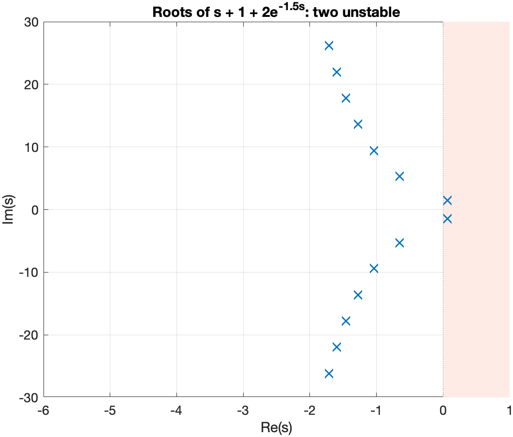

# Tutorial 1 — First roots

**Goal:** use `croots` on three functions of increasing difficulty, and
learn how the search rectangle and the analyticity assumption affect the
result.

**You need:** ContourRoots on the path (`setup_contourroots`). No other
toolbox.

## 1.1 A polynomial: nothing new, but a useful check

For a polynomial, `croots` must agree with `roots` inside the rectangle:

```matlab
c = poly([-1, -2+3i, -2-3i, 4]);         % roots -1, -2 +- 3i and 4
r = croots(c, [-5 1 -5 5])               % 4 is outside the rectangle
```

Only the three roots inside $-5 < \mathrm{Re}\,s < 1$,
$-5 < \mathrm{Im}\,s < 5$ are returned. **The rectangle is part of the
question**: ContourRoots never looks outside it.

## 1.2 An exponential: infinitely many roots

$F(s) = e^{s} - 2$ vanishes at $s = \ln 2 + 2\pi i k$ for every integer $k$:
a vertical line of roots. In the rectangle $[-1, 2] \times [-20, 20]$ there
are seven of them ($k = -3, \dots, 3$):

```matlab
F = @(s) exp(s) - 2;
[r, info] = croots(F, [-1 2 -20 20], 'AssumeAnalytic', true);
exact = log(2) + 2i*pi*(-3:3).';
max(arrayfun(@(z) min(abs(r - z)), exact))   % about 1e-15
info.status
```

## 1.3 The analyticity assumption

A function is **analytic** (or *holomorphic*) in a region when it has a
complex derivative at every point of it. Polynomials, `exp`, `sin`, `cos`,
`sinh`, `cosh` and their sums, products and compositions are analytic
everywhere (*entire* functions). Division by something that vanishes,
`sqrt`, `log` and `abs` break analyticity somewhere.

The method relies on analyticity (see [Tutorial 4](04_how_it_works.md)).
MATLAB cannot look inside an arbitrary function handle, so you declare it:

```matlab
[~, info1] = croots(F, [-1 2 -20 20]);                          % no declaration
[~, info2] = croots(F, [-1 2 -20 20], 'AssumeAnalytic', true);  % declared
{info1.status, info2.status}
```

Without the declaration the search is **exploratory**: it starts Newton's
method from a grid of points and returns what it finds, but it cannot say
whether something was missed. With the declaration, the roots are counted
by contour integrals and the result is **numerically complete**.

> Declaring a function analytic when it is not (for example
> `@(s) 1./(s-1) - 2` around $s = 1$) makes the counts meaningless. When in
> doubt, write the function as a numerator and a denominator with `ndpair`
> ([Tutorial 2](02_poles_and_zeros.md)).

## 1.4 A system with a delay

The scalar delay-differential equation

$$\dot x(t) = -x(t) - 2\,x(t - T)$$

has solutions $e^{st}$ when $s + 1 + 2e^{-sT} = 0$. For $T = 1.5$:

```matlab
T = 1.5;
F = @(s) s + 1 + 2*exp(-s*T);
[r, info] = croots(F, [-6 1 -30 30], 'AssumeAnalytic', true);
r(1:2)             % 0.0656 +- 1.4662i: positive real part
numel(r)
```

The rightmost pair has a positive real part, so solutions grow like
$e^{0.0656\,t}$: the system is unstable. The other roots form two chains
that move to the left as $|\mathrm{Im}\,s|$ grows, which is typical of
delay equations.



At which delay does the instability start? A root crosses the imaginary
axis, $s = i\omega$, when $i\omega + 1 = -2e^{-i\omega T}$. Taking absolute
values, $1 + \omega^2 = 4$, so $\omega = \sqrt{3}$; the phase then gives
$T = 2\pi / (3\sqrt 3) \approx 1.2092$. [Tutorial 5](05_time_delay_systems.md)
turns this reasoning into the function `critical_delays`:

```matlab
crit = critical_delays(2, [1 1], 2);     % N = 2, D = s + 1, 0 <= T <= 2
crit.Delay                               % 1.2092
```

## 1.5 Choosing the rectangle

- **Include what matters.** For stability, the rectangle must contain the
  right half-plane part where roots can be. For delay equations of the
  *retarded* type, [`rhp_root_bound`](../api/rhp_root_bound.md) gives a
  radius that contains every unstable root.
- **Avoid roots on the edges.** A root exactly on the boundary cannot be
  counted. ContourRoots reports it instead of guessing:

```matlab
[~, info] = croots(@(s) s.^2 + 1, [-1 1 -1 1], 'AssumeAnalytic', true);
info.status              % 'unresolved': +-1i lie on the top and bottom edges
[~, info] = croots(@(s) s.^2 + 1, [-1 1 -1.1 1.1], 'AssumeAnalytic', true);
info.status              % 'numerically_complete'
```

- **Larger is slower, not less accurate.** Very tall rectangles over
  oscillatory functions need more contour points; the solver refines them
  automatically up to `ContourRefinements`.

## Summary

- `croots(F, region)` returns the roots of `F` inside `region`.
- Declare `'AssumeAnalytic',true` when `F` is analytic; otherwise the search
  is exploratory.
- Check `info.status`; `'numerically_complete'` is what you want.

Next: [Tutorial 2 — Poles and zeros](02_poles_and_zeros.md).
