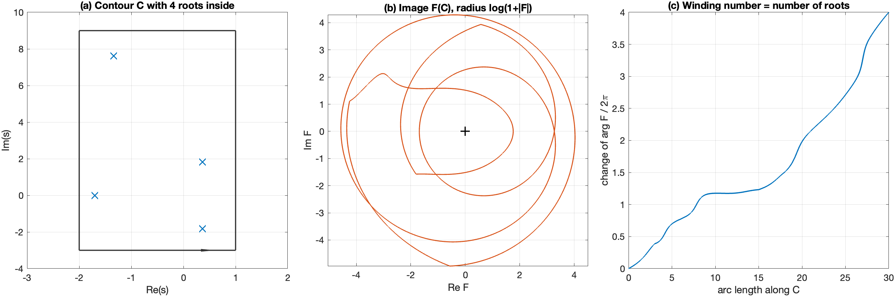

# Tutorial 4 — How it works

**Goal:** understand the algorithm well enough to trust its results, to
read its diagnostics, and to recognize when it can fail. The
[manual](../ContourRoots_manual.pdf) gives the same material with proofs.

## 4.1 Counting roots without finding them: the argument principle

Let $F$ be analytic inside and on a closed curve $C$, with no zero on $C$.
Then the number of zeros of $F$ inside $C$, counted with multiplicity, is

$$
Z = \frac{1}{2\pi i}\oint_C \frac{F'(s)}{F(s)}\,ds
  = \frac{1}{2\pi}\,\Delta_C \arg F(s).
$$

The right-hand side is the **winding number**: follow $s$ once around $C$
counterclockwise, watch the angle of the complex number $F(s)$, and count
how many full turns it makes around the origin. Every simple zero inside
$C$ adds one turn.



In the figure, $C$ is the rectangle $[-2, 1] \times [-3, 9]$ and
$F(s) = s^2 + s + 1 + (2s+3)e^{-s}$. Four roots lie inside (a). The image
of $C$ under $F$ (b, with the radius compressed logarithmically) turns
around the origin four times, and the unwrapped angle (c) grows by exactly
$4 \times 2\pi$. You can compute the same number yourself:

```matlab
F = @(s) s.^2 + s + 1 + (2*s + 3).*exp(-s);
rect = [-2 1 -3 9];
n = 2000; t = (0:n-1)/n;
C = [rect(1) + diff(rect(1:2))*t + 1i*rect(3), ...        % bottom, left to right
     rect(2) + 1i*(rect(3) + diff(rect(3:4))*t), ...       % right, upwards
     rect(2) - diff(rect(1:2))*t + 1i*rect(4), ...         % top, right to left
     rect(1) + 1i*(rect(4) - diff(rect(3:4))*t)];          % left, downwards
w = F([C C(1)]);
winding = sum(angle(w(2:end)./w(1:end-1)))/(2*pi)          % 4.0000
```

Two observations explain most of the design:

1. **Sampling must be fine enough.** Between two samples the angle of $F$
   must change by less than $\pi$, otherwise a turn can be missed. The
   solver doubles the number of points until the count stops changing
   and every angle increment is below $\pi/3$.
2. **The count needs analyticity.** For a function with poles, the same
   integral gives *zeros minus poles*. This is why a quotient must be given
   as `ndpair(N, D)`, and why opaque handles are only explored.

## 4.2 From counts to locations: subdivision and Newton

The count tells *how many*, not *where*. The solver combines it with
Newton's method in a recursive search:

```text
search(box, count):
    if count == 0: return                          # nothing inside
    for each start in [log-moment center, box center, user seeds]:
        z = damped Newton from start, kept inside box
        if a tiny box around z contains exactly `count` zeros:
            accept z with multiplicity `count`; return
    split box in two halves (along its longer side)
    count both halves; if counts add up to `count`:
        search(left half), search(right half)
    else: try a slightly shifted split line (a zero may lie on it)
    if nothing works, or depth/cell budget exhausted: mark box unresolved
```

Details that matter in practice:

- **Newton's method** is damped: steps are limited to half the box size and
  shortened (backtracking) when $|F|$ does not decrease. For a cluster of
  $m$ zeros it uses the step $m F/F'$, which converges quickly to a multiple
  root. The derivative is the one you provide (`Derivative`), the exact one
  for symbolic input, or a four-point complex finite difference.
- **Each root is confirmed by a local count** in a small box of half-width
  `RootTolerance*(1+|z|)`. A root is accepted only if this local count
  equals the count of the cell; that local count is also its multiplicity.
- **The log-moment center** $\frac{1}{2\pi i\,Z}\oint_C s\,\frac{F'}{F}\,ds$ is
  the average position of the zeros inside $C$; when $Z = 1$ it *is* the
  zero, which makes it an excellent first guess.
- **Conservation.** A subdivision is accepted only if the counts of the two
  halves add up to the count of the parent. This detects zeros on the
  split line; the solver then tries two other split positions.
- **Budgets.** `MaxDepth` (24) limits the recursion depth, and `MaxCells`
  (5000) the total number of cells. Unresolved cells are never dropped
  silently: they are listed in `info.unresolvedBoxes`, and the status
  becomes `unresolved`.

## 4.3 Poles and cancellations

For `ndpair(N, D)`:

- `cpoles` searches the zeros of $D$. Around each one, it counts the zeros
  of $N$ in the same tiny box, and subtracts. If the numerator order is at
  least the denominator order, the location is *cancelled*
  (`info.cancelledLocations`); otherwise the pole keeps the difference as
  its multiplicity.
- `czeros` does the same with the roles of $N$ and $D$ exchanged.

The cancellation test has the resolution of the tiny box. A pole and a zero
closer than `RootTolerance` are treated as cancelled. When this distinction
matters, reduce `RootTolerance`, and if possible confirm the cancellation
analytically.

## 4.4 The exploratory mode

When a handle is not declared analytic, the solver cannot rely on counts. It
runs Newton from a `GridSize` grid of starting points plus your seeds,
keeps the points where a local contour confirms a zero, and returns them
with `info.status = 'exploratory'` and `info.complete = false`. The result
is often right, but nothing guarantees that every root was found.

## 4.5 What "numerically complete" means

`info.complete` is `true` when:

1. the outer contour count converged (enough samples, no zero or overflow
   on the boundary);
2. every cell of the subdivision was resolved; and
3. the multiplicities of the returned roots add up to the outer count.

This is strong evidence, but not a proof: the contour is sampled at finitely
many points, so a function that oscillates wildly between samples could in
principle fool it, and the analyticity of a handle is your declaration. The
[diagnostics page](../diagnostics_and_limits.md) lists these limits and how
to probe them (e.g. by changing `ContourPoints` or shifting the rectangle).

Next: [Tutorial 5 — Time-delay systems](05_time_delay_systems.md).
