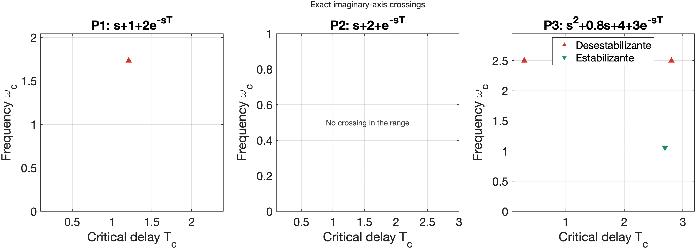
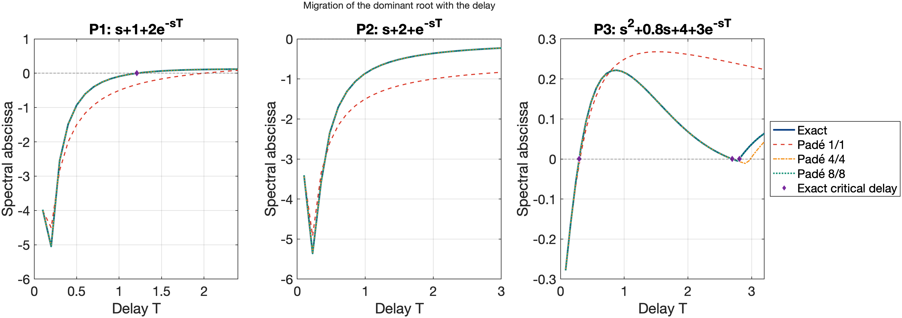

# Tutorial 5 — Time-delay systems

**Goal:** decide the stability of a system with a time delay **for every
value of the delay**, without approximating the delay.

The tools of this tutorial (folder `matlab/delay/`) handle the scalar
equation

$$F(s, T) = D(s) + N(s)\,e^{-sT} = 0,$$

with real polynomials $D$ (degree $m$) and $N$ (degree $p < m$), given as
coefficient vectors. The condition $p < m$ means the system is *retarded*:
the highest derivative is not delayed. This is the most common case in
control (a rational plant in a loop with a delay).

## 5.1 Three examples

| Case | Equation | Behavior |
|---|---|---|
| P1 | $s + 1 + 2e^{-sT} = 0$ | stable for small $T$, unstable after $T_c \approx 1.209$ |
| P2 | $s + 2 + e^{-sT} = 0$ | stable for **every** $T \ge 0$ |
| P3 | $s^2 + 0.8s + 4 + 3e^{-sT} = 0$ | switches between stable and unstable |

P1 is $\dot x(t) = -x(t) - 2x(t-T)$. P3 is an oscillator
$\ddot x + 0.8\dot x + 4x = -3x(t - T)$ with delayed position feedback.

## 5.2 Where can roots cross the imaginary axis?

As $T$ grows, the roots move continuously. New roots appear only far to the
left, so **stability can change only when a root crosses the imaginary
axis**, at some $s = i\omega$. There,

$$e^{-i\omega T} = -\frac{D(i\omega)}{N(i\omega)}.$$

The left side has modulus one for every $T$. Hence the crossing frequencies
do not depend on $T$ and solve the polynomial equation

$$G(\omega) = |D(i\omega)|^2 - |N(i\omega)|^2 = 0.$$

For P1, $G(\omega) = (1 + \omega^2) - 4$, so $\omega = \sqrt 3$. For P2,
$G(\omega) = \omega^2 + 3 > 0$: **no crossing is possible**, and since P2
is stable at $T = 0$, it is stable for every delay.

## 5.3 When: the critical delays

The phase of the same equation gives, for each crossing frequency
$\omega_i$, infinitely many delays

$$T_{i,k} = \frac{\theta_i + 2\pi k}{\omega_i}, \qquad k = 0, 1, 2, \dots$$

where $\theta_i \in [0, 2\pi)$ is the phase of $-D(i\omega_i)/N(i\omega_i)$
with a sign change. `critical_delays` computes all of them up to `Tmax`,
refines each pair $(\omega, T)$ with Newton's method, and checks the
residual:

```matlab
crit = critical_delays(2, [1 1], 10)          % P1
```

| Column | Meaning |
|---|---|
| `Frequency` | $\omega$, the crossing frequency |
| `Delay` | $T$, the critical delay |
| `Branch` | $k$ in the formula above |
| `CrossingSpeed` | $\mathrm{Re}(ds/dT)$ at the crossing |
| `Direction` | `"destabilizing"` (into the right half-plane) or `"stabilizing"` |
| `Residual` | $\lvert F(i\omega, T)\rvert$ |

## 5.4 In which direction?

A crossing with $\mathrm{Re}(ds/dT) > 0$ moves a pair of roots into the
right half-plane. A classical result (Cooke and van den Driessche, 1986;
proof in the [manual](../ContourRoots_manual.pdf)) gives the sign directly:

$$\operatorname{sign} \mathrm{Re}\frac{ds}{dT} = \operatorname{sign} G'(\omega).$$

So **all crossings at the same frequency go in the same direction**. In P3,
$G(\omega) = \omega^4 - 7.36\omega^2 + 7$ has two positive roots,
$\omega_1 \approx 2.498$ (where $G' > 0$) and $\omega_2 \approx 1.059$
(where $G' < 0$). Crossings at $\omega_1$ always destabilize; crossings at
$\omega_2$ always stabilize:

```matlab
crit3 = critical_delays(3, [1 0.8 4], 10);
crit3(:, {'Frequency', 'Delay', 'Branch', 'Direction'})
```



## 5.5 Counting unstable roots for every delay

Each crossing moves one conjugate pair. Starting from the number $Z(0)$ of
unstable roots of $D + N$,

$$Z(T) = Z(0) + 2\sum_{T_{i,k} < T} \operatorname{sign} G'(\omega_i).$$

The table above therefore gives the complete stability map:

```matlab
Z0 = sum(real(roots([1 0.8 4] + [0 0 3])) > 0);    % roots of D + N at T = 0
T = linspace(0, 10, 2001);
Z = Z0 + 2*sum(sign(crit3.CrossingSpeed).' .* (T(:) > crit3.Delay.'), 2);
figure, stairs(T, Z), xlabel('delay T'), ylabel('unstable roots Z(T)')
stable = T(Z == 0);   % stable delays
```

For P3 this reveals a narrow **stability window**:

| Delay interval | $Z(T)$ |
|---|---|
| $0 \le T < 0.2918$ | 0 (stable) |
| $0.2918 < T < 2.6953$ | 2 |
| $2.6953 < T < 2.8076$ | **0 (stable again)** |
| $2.8076 < T < 5.3233$ | 2 |
| $5.3233 < T < 7.8390$ | 4 |
| $7.8390 < T < 8.6265$ | 6 |
| $8.6265 < T \le 10$ | 4 |

A sweep of $T$ in steps of 0.1 would probably miss the window of width
0.112. The formula finds it directly.



## 5.6 An independent check: counting in a bounded region

In the right half-plane $|e^{-sT}| \le 1$, so a root there must satisfy
$|D(s)| \le |N(s)|$. When $p < m$ this confines every unstable root, for
every delay, to a disk of radius $R$ computed by `rhp_root_bound`. The
argument principle on the rectangle $[0, R+1] \times [-(R+1), R+1]$ then
counts the unstable roots without guessing a search window:

```matlab
R = rhp_root_bound(3, [1 0.8 4])                     % about 3.08
Zcheck = arrayfun(@(t) unstable_root_count(3, [1 0.8 4], t), [1 2.75 3 6 9])
% 2 0 2 4 4: the same as the table above
```

The bound is a mathematical fact; the count is a floating-point contour
computation (reliable away from the critical delays, where a root sits on
the imaginary axis).

## 5.7 Roots for a particular delay

For one value of $T$, `croots` gives the roots themselves:

```matlab
T = 2.75;                                            % inside the window
F = @(s) s.^2 + 0.8*s + 4 + 3*exp(-s*T);
[r, info] = croots(F, [-4 1 -30 30], 'AssumeAnalytic', true);
max(real(r))                                         % slightly negative
```

The older function `delay_roots` does the same job for this class with a
grid of Newton starts; it is kept for compatibility (see
[its reference page](../api/delay_tools.md)).

## Summary

- Crossing frequencies come from a polynomial in $\omega^2$; critical
  delays from the phase; directions from $\operatorname{sign} G'(\omega)$.
- `critical_delays` returns all of them; the stability map follows by
  counting.
- `unstable_root_count` checks the map independently.
- No Padé approximation is involved. The next tutorial shows what happens
  when one is used.

Next: [Tutorial 6 — The pitfalls of Padé](06_pade_pitfalls.md).
