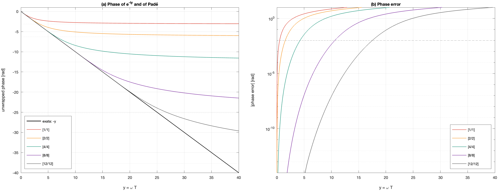
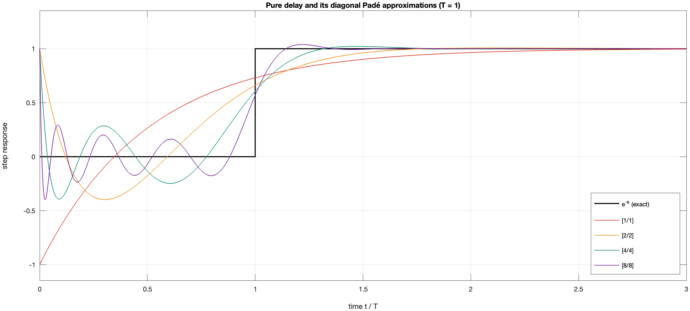
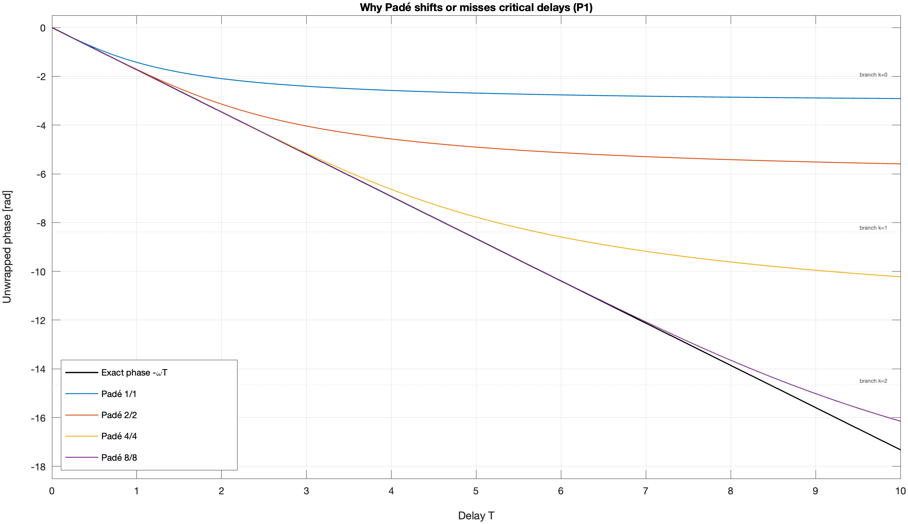
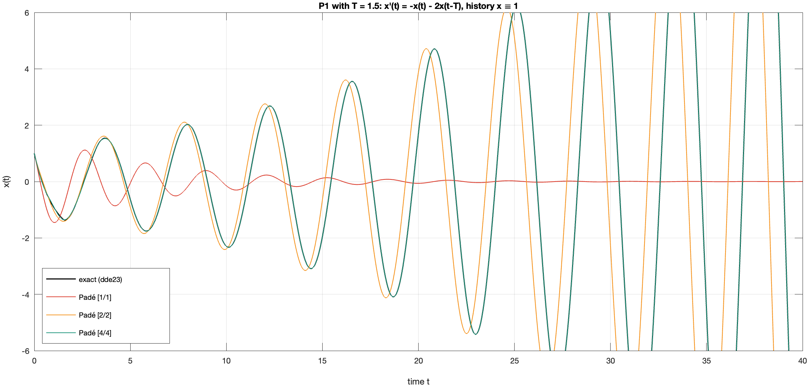
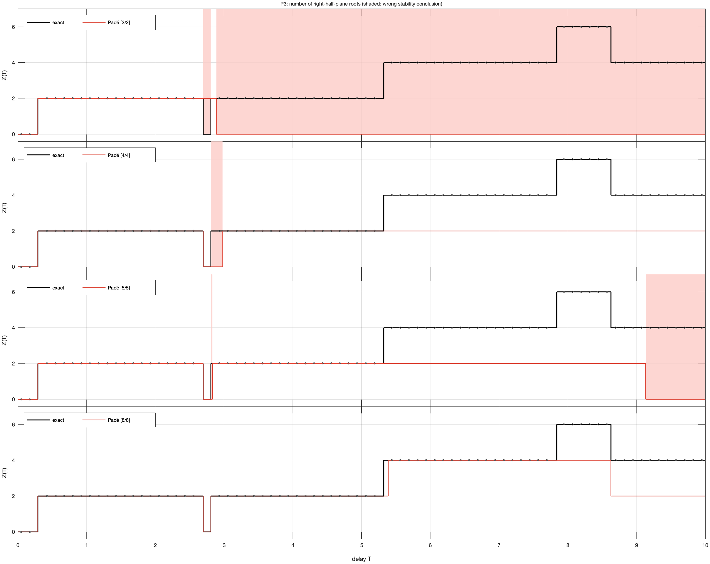

# Tutorial 6 — The pitfalls of Padé approximations

**Goal:** understand exactly what a Padé approximation of a delay keeps and
what it loses, and see, on the examples of [Tutorial 5](05_time_delay_systems.md),
how it can lead to wrong stability conclusions.

## 6.1 The approximation

The diagonal Padé approximation of order $n$ replaces the delay by a
rational function whose Taylor series agrees with $e^{-sT}$ up to the term
$(sT)^{2n}$:

$$e^{-sT} \approx \frac{P_n(sT)}{Q_n(sT)}, \qquad
\frac{1 - sT/2}{1 + sT/2} \ (n = 1), \qquad
\frac{1 - sT/2 + (sT)^2/12}{1 + sT/2 + (sT)^2/12} \ (n = 2).$$

The characteristic equation becomes the polynomial
$D(s)Q_n(sT) + N(s)P_n(sT) = 0$ of degree $m + n$: infinitely many roots are
replaced by finitely many, and every tool for finite-dimensional systems
applies. `pade_delay(T, n)` returns the coefficients, and
`pade_characteristic(N, D, T, n)` the polynomial.

## 6.2 Three structural properties

**Exact gain.** Because $P_n(z) = Q_n(-z)$, the approximation has modulus
one on the imaginary axis, like the delay itself: it is *all-pass*.

**Bounded phase.** The phase of the approximation at $y = \omega T$
behaves like $-y$ near $0$, but it is monotone and **saturates at
$-n\pi$**, whereas the true phase $-y$ is unbounded:



**Right-half-plane zeros.** The $n$ zeros of $P_n(sT)$ have positive real
part. The step response of the approximation jumps to $(-1)^n$ at $t = 0$
and oscillates before $t = T$, while the true delay stays at zero:



## 6.3 What Padé keeps

Since the gain is exact, **a Padé model can cross the imaginary axis only
at the crossing frequencies of the true equation**: they come from
$|D(i\omega)| = |N(i\omega)|$, which does not involve the phase. Whether a
crossing actually occurs at a given frequency, and at which delay, depends
on the phase condition (next section). One can also prove (see the
[manual](../ContourRoots_manual.pdf)) that each crossing of the Padé model
has the **same direction** as the true crossings at that frequency.
Conclusions that depend only on the gain are preserved: P2, stable for
every delay, is also stable for every delay with any Padé order.

## 6.4 What Padé loses: the phase at large $\omega T$

The critical delays come from the phase. With Padé, they solve
$\phi_n(\omega_i T) = -(\theta_i + 2\pi k)$, where $\phi_n$ is the bounded
Padé phase. Two consequences:

1. The delays are **shifted**, a little when $\omega T$ is small, a lot when
   it is not.
2. Since $\phi_n > -n\pi$, only the branches with $\theta_i + 2\pi k < n\pi$
   exist: about $n/2$ crossings per frequency, **for all $T$**, instead of
   infinitely many.

```matlab
exact = critical_delays(2, [1 1], 10);           % P1: 1.209, 4.837, 8.464
pade  = pade_critical_delays(2, [1 1], 10, [1 2 4 8]);
pade(:, {'Order', 'Delay'})
```

| Order | Critical delays of P1 up to $T = 10$ |
|---|---|
| exact | 1.2092, 4.8368, 8.4644 |
| [1/1] | 2.0000 |
| [2/2] | 1.2361 |
| [4/4] | 1.2092, 5.7073 |
| [8/8] | 1.2092, 4.8370, 8.7234 |



## 6.5 A non-conservative delay margin

For P1, the first-order model predicts the first critical delay at
$T = 2$, 65% above the true value 1.2092. The error has a dangerous sign:
it *overestimates* the tolerable delay. At $T = 1.5$ the Padé [1/1] model is
stable (its rightmost root is at $-1/6$), while the real system is unstable
(rightmost root $0.0656 \pm 1.466i$). The simulation of the delay equation
with MATLAB's `dde23` confirms it:



```matlab
T = 1.5;
pade1 = roots(pade_characteristic(2, [1 1], T, 1));   % Padé [1/1] model
max(real(pade1))                                      % -0.1667: "stable"
Z = unstable_root_count(2, [1 1], T)                  % 2: unstable
```

## 6.6 Stability windows erased, shifted, or invented

In P3 the stability depends on the *order* of crossings at two different
frequencies, so a shift of one crossing can change the qualitative
conclusion. The figure compares $Z(T)$ for the exact equation and for Padé
models (shaded: the Padé model gets the stability wrong):



| Model | Stable delay intervals in $[0, 10]$ |
|---|---|
| exact | $[0, 0.2918)$, $(2.6953, 2.8076)$ |
| [1/1] | $[0, 0.3055)$ — the window is **erased** |
| [2/2] | $[0, 0.2919)$, $(2.8872, 10]$ — **stable for all larger delays**, which is false |
| [3/3] | $[0, 0.2918)$, $(2.7059, 4.0358)$ — window 12 times too wide |
| [4/4] | $[0, 0.2918)$, $(2.6957, 2.9797)$ — window 2.5 times too wide |
| [5/5] | $[0, 0.2918)$, $(2.6953, 2.8317)$, $(9.1311, 10]$ — an **invented** stable region |
| [8/8] | $[0, 0.2918)$, $(2.6953, 2.8076)$ — correct in $[0, 10]$ |

Only from order 10 on is the number of unstable roots right over the whole
interval $[0, 10]$, and any fixed order fails again if the interval is
extended far enough.

You can reproduce the [2/2] conclusion in a few lines, using the fact that
crossing directions are inherited from the exact equation:

```matlab
exact = critical_delays(3, [1 0.8 4], 10);
p2 = pade_critical_delays(3, [1 0.8 4], 10, 2);
dirOf = @(w) sign(exact.CrossingSpeed(find(abs(exact.Frequency - w) < 1e-7, 1)));
p2.Direction = arrayfun(dirOf, p2.Frequency);
p2(:, {'Frequency', 'Delay', 'Direction'})
% Two events: +1 at 0.2919 and -1 at 2.8872, then nothing: Z = 0 for T > 2.887
```

## 6.7 How far is Padé accurate?

The phase error depends only on $y = \omega T$. The largest $y$ at which
the phase error stays below 0.01 rad is:

| Order $n$ | 1 | 2 | 3 | 4 | 6 | 8 | 10 | 12 |
|---|---|---|---|---|---|---|---|---|
| $y_{0.01}$ | 0.50 | 1.53 | 2.81 | 4.24 | 7.34 | 10.62 | 14.02 | 17.50 |

For P1, the first crossing has $y = \omega_c T_c = 2\pi/3 \approx 2.09$:
beyond the range of orders 1 and 2, within that of order 4, which is why
[4/4] is accurate there. Roughly, $y_{0.01} \approx 1.6n - 2$ for $n \ge 4$.

High orders have a price of their own: the expanded polynomial
$D Q_n + N P_n$ becomes badly conditioned. In P3, computing its roots with
`roots` gave a wrong number of unstable roots for 24 of 99 small delays
with $n = 10$, and 64 of 99 with $n = 12$ (a balanced state-space
realization avoids this).

## 6.8 Guidelines

1. **Decide stability on the original equation**: `critical_delays`,
   the counting formula of Tutorial 5, and `unstable_root_count`.
2. **Use Padé as a local tool**: controller design near an operating point,
   low-order simulation models, or seeds for Newton (`SeedPoints`).
3. **Choose the order from $\omega T$**, with the table above, never by habit.
4. **Distrust stability windows and "stable for all larger delays"**
   predicted by a rational model.
5. **Check in the time domain** with `dde23` near critical delays.
6. **Do not interpret** far-away Padé poles or the initial jump of the step
   response physically.

The complete study, including all figures of this tutorial, is
`examples/time_delay/run_delay_study.m` (it also runs
`run_pade_critical_study.m` and `run_pade_pitfalls.m`).

Next: [Tutorial 7 — Distributed-parameter systems](07_distributed_systems.md).
