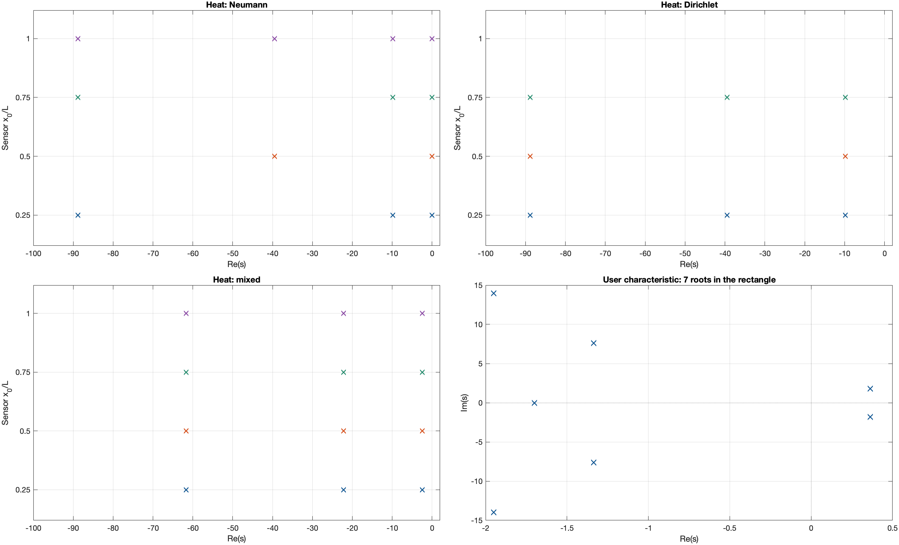
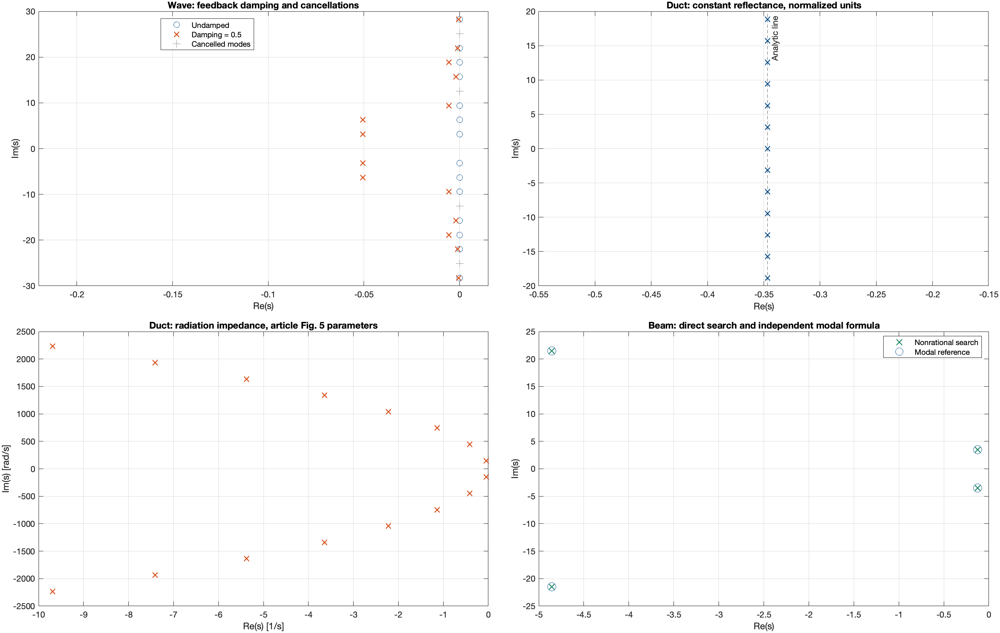
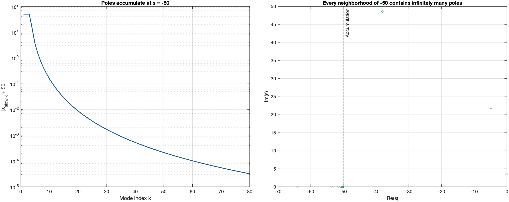

# Tutorial 7 — Distributed-parameter systems

**Goal:** compute poles of transfer functions of partial differential
equations (heat, string, duct, beam) without truncating them to a finite
number of modes, and learn how to write such transfer functions as a pair
of analytic functions.

The models follow Curtain and Morris, *Transfer functions of distributed
parameter systems: a tutorial*, Automatica 45 (2009) 1101–1116
([doi:10.1016/j.automatica.2009.01.008](https://doi.org/10.1016/j.automatica.2009.01.008)).
They are implemented in `examples/models/distributed_model.m`, which is an
example helper, not part of the toolbox API. Add it to the path first:

```matlab
root = fileparts(fileparts(which('croots')));
addpath(fullfile(root, 'examples', 'models'))
```

## 7.1 Square roots that are not really there

The heat equation $w_t = w_{xx}$ on $0 < x < 1$ leads to transfer functions
written with $\sqrt s$, for example $\cosh(\sqrt s)$ and
$\sinh(\sqrt s)/\sqrt s$. A square root has a branch cut, which would break
the argument principle. But these two combinations are **entire**:

$$C(q) = \cosh\sqrt q = \sum_{k\ge 0}\frac{q^k}{(2k)!}, \qquad
H(q) = \frac{\sinh\sqrt q}{\sqrt q} = \sum_{k\ge 0}\frac{q^k}{(2k+1)!}.$$

Only integer powers of $q$ appear: the choice of the square root does not
matter, and there is no cut. The only numerical issue is $H(0) = 0/0$,
fixed by using the series near $q = 0$:

```matlab
H = @(q) sinhc_sqrt(q);
H([0 1e-8 -pi^2])            % 1, 1.0000, ~0 (a zero at q = -pi^2)

function y = sinhc_sqrt(q)
    y = ones(size(q));
    small = abs(q) < 1e-4;
    v = q(small);  y(small) = 1 + v/6 + v.^2/120 + v.^3/5040;
    v = sqrt(q(~small));  y(~small) = sinh(v)./v;
end
```

With $N$ and $D$ written this way, `'AssumeAnalytic',true` is correct.

## 7.2 Heat equation: where the sensor is matters

With a boundary input and a point sensor at $x_0$, the three boundary
conditions of the paper give

$$G_N = \frac{C(x_0^2 s)}{s\,H(s)}, \qquad
G_D = \frac{x_0 H(x_0^2 s)}{H(s)}, \qquad
G_M = \frac{x_0 H(x_0^2 s)}{C(s)}.$$

```matlab
kinds = {'heat_neumann', 'heat_dirichlet', 'heat_mixed'};
for k = 1:3
    G = distributed_model(kinds{k}, 'Sensor', 0.5);
    [p, info] = cpoles(G, [-100 2 -3 3], 'AssumeAnalytic', true);
    fprintf('%-15s poles/pi^2: %s   cancelled: %d\n', kinds{k}, ...
        mat2str(real(p.')/pi^2, 4), numel(info.cancelledLocations));
end
```

With the sensor at the middle, Neumann keeps $0$ and $-4\pi^2$ and cancels
$-\pi^2$ and $-9\pi^2$; Dirichlet keeps $-\pi^2$ and $-9\pi^2$ and cancels
$-4\pi^2$; the mixed case keeps $-\pi^2/4$, $-9\pi^2/4$, $-25\pi^2/4$. Moving
the sensor changes which modes are visible:



## 7.3 String: modes that the actuator cannot excite

For the damped string with the actuator distribution $b(x) = 1$ on
$[0, 1/2]$, the modal coefficient is proportional to $1 - \cos(k\pi/2)$,
which vanishes for $k$ multiple of 4. Those modes are not poles:

```matlab
G = distributed_model('wave', 'Damping', 0);
[p, info] = cpoles(G, [-1 1 -20 20], 'AssumeAnalytic', true);
imag(p.')/pi                    % +-1, 2, 3, 5, 6 : no 4
```

## 7.4 Duct: poles on a vertical line, or a curve

With constant reflectance $a = 0.5$, the poles of the acoustic duct are
$\ln(a)/2 + i\pi k$. With the radiation impedance of the paper (Fig. 5
parameters), the reflectance depends on frequency and the poles bend to
the left:

```matlab
G = distributed_model('duct_constant', 'Reflectance', 0.5);
p = cpoles(G, [-2 1 -11 11], 'AssumeAnalytic', true);
max(abs(real(p) - log(0.5)/2))  % about 1e-15
```



## 7.5 Beam with Kelvin–Voigt damping: an accumulation point

The Euler–Bernoulli beam with internal (Kelvin–Voigt) damping $c_d$ has
poles given by $s^2 + c_d\beta_k^4 s + \beta_k^4 = 0$, where
$1 + \cosh\beta_k\cos\beta_k = 0$. As $k \to \infty$, one branch of poles
converges to $s = -1/c_d$: **every neighborhood of $-1/c_d$ contains
infinitely many poles**. No contour around that point can be resolved, so
the region must exclude it. `distributed_model` reports the point in
`meta.singularities`, and the option `Singularities` makes ContourRoots
refuse a region that contains it:

```matlab
[G, meta] = distributed_model('beam', 'Damping', 0.02);
meta.singularities                                   % -50
[p, info] = cpoles(G, [-25 2 -160 160], 'AssumeAnalytic', true, ...
    'Singularities', meta.singularities);
info.status
try
    cpoles(G, [-60 2 -10 10], 'AssumeAnalytic', true, ...
        'Singularities', meta.singularities);
catch err
    disp(err.message)                                % region rejected
end
```



## 7.6 Results summary

The study `examples/distributed_systems/run_nonrational_examples.m`
computes all models and compares them with independent analytical or modal
formulas:

| Model | Rectangle | Poles | Cancelled | Max. error vs. reference |
|---|---|---:|---:|---:|
| Heat, Neumann | $[-100, 2] \times [-3, 3]$ | 2 | 2 | $5\times10^{-14}$ |
| Heat, Dirichlet | $[-100, 2] \times [-3, 3]$ | 2 | 1 | $1\times10^{-14}$ |
| Heat, mixed | $[-100, 2] \times [-3, 3]$ | 3 | 0 | $7\times10^{-15}$ |
| String, undamped | $[-2, 1] \times [-30, 30]$ | 14 | 4 | $3\times10^{-21}$ |
| String, feedback 0.5 | $[-2, 1] \times [-30, 30]$ | 14 | 4 | (no closed form) |
| Duct, constant reflectance | $[-2, 1] \times [-20, 20]$ | 13 | 0 | $2\times10^{-12}$ |
| Duct, radiation impedance | $[-400, 30] \times [-2500, 2500]$ | 16 | 0 | (no closed form) |
| Beam, Kelvin–Voigt $0.02$ | $[-25, 2] \times [-160, 160]$ | 4 | 0 | $7\times10^{-15}$ |

The references are used only for comparison, never as Newton seeds. The
numbers refer to the stated rectangles only.

## Summary

- Write each factor as an entire function; replace removable
  singularities by series.
- Even functions of $\sqrt q$ (or of $q^{1/4}$ with the right symmetry) are
  entire.
- Declare known branch or accumulation points with `Singularities`.
- Input/output poles can hide modes; see [Tutorial 2](02_poles_and_zeros.md).

Next: [Tutorial 8 — Beam coupled to an oscillator](08_coupled_beam.md).
