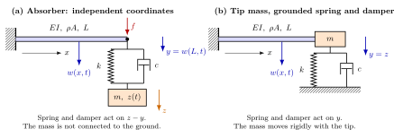
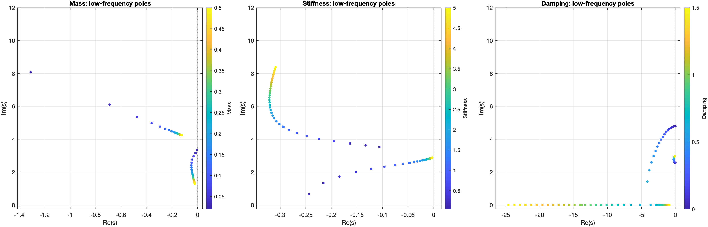
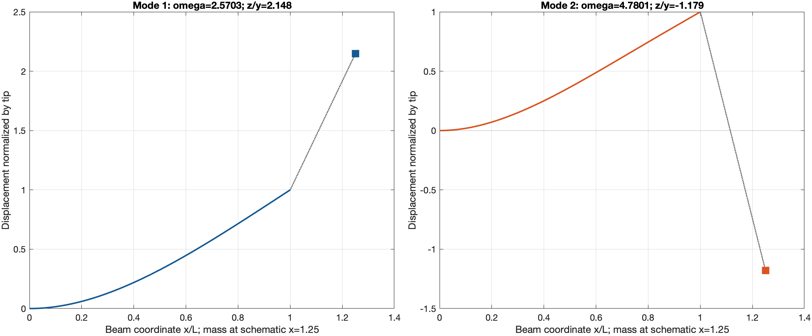
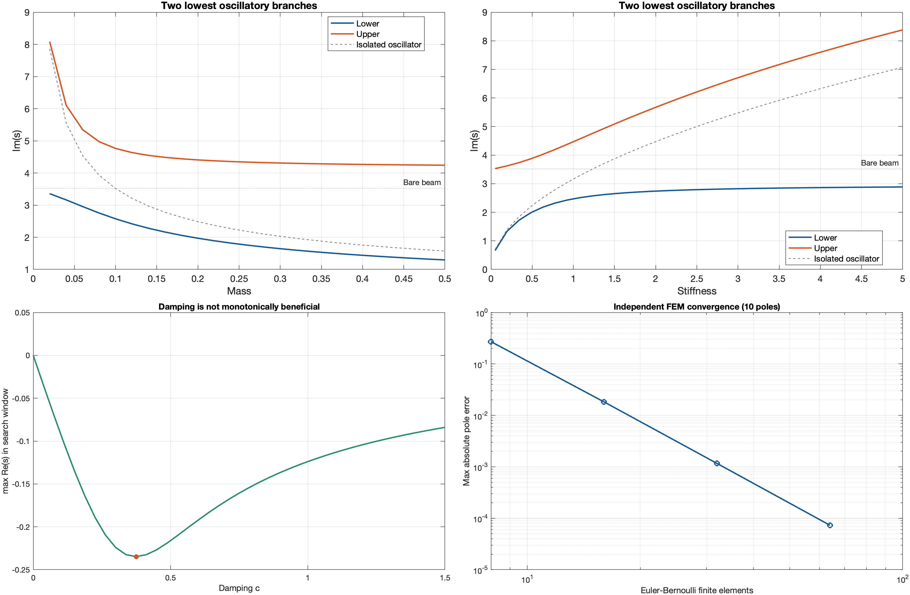

# Tutorial 8 — A beam coupled to an oscillator

**Goal:** derive the transfer function of a system that couples a partial
differential equation (a beam) to an ordinary one (a mass-spring-damper),
write it as $N(s)/D(s)$ with analytic factors, and compute its poles
without modal truncation. The example also shows how to study parameters
and how to validate results independently.



## 8.1 The physical model

A uniform, undamped Euler–Bernoulli beam of length $L$, bending stiffness
$EI$ and mass per length $\mu_b = \rho A$ is clamped at $x = 0$. At the free
end, a mass $m$ with its own displacement $z(t)$ is connected to the tip
displacement $y(t) = w(L,t)$ by a spring $k$ and a viscous damper $c$ in
parallel: a *tuned mass absorber* (topology (a) above). The mass is not
connected to the ground. Gravity, rotary inertia, shear deformation and
large displacements are neglected. Displacements are positive downwards.

$$\mu_b w_{tt} + EI\,w_{xxxx} = 0, \quad 0 < x < L, \qquad
w(0,t) = w_x(0,t) = 0,$$

$$EI\,w_{xx}(L,t) = 0, \qquad -EI\,w_{xxx}(L,t) = f(t),$$

where $f$ is the force of the connection **on the beam**. It depends on the
relative motion, and the force on the mass has the opposite sign:

$$f = k(z - y) + c(\dot z - \dot y), \qquad
m\ddot z + c(\dot z - \dot y) + k(z - y) = u(t).$$

An external force $F$ at the tip adds to $f$ in the shear condition. For the
poles, set $F = u = 0$ and look for solutions proportional to $e^{st}$.

## 8.2 The bare beam: an exact receptance

With $w(x,t) = W(x)e^{st}$ and $\theta^4 = q = -\mu_b L^4 s^2/EI$, the clamped
solution is $W(x) = a[\cosh(bx) - \cos(bx)] + d[\sinh(bx) - \sin(bx)]$,
$b = \theta/L$. The zero-moment condition fixes $d/a$, and the ratio of tip
displacement to tip force is

$$H_b(s) = \frac{y}{f} = \frac{L^3}{EI}\,\frac{A(q)}{B(q)}, \quad
A(q) = \frac{\cosh\theta\sin\theta - \sinh\theta\cos\theta}{\theta^3}, \quad
B(q) = 1 + \cosh\theta\cos\theta.$$

Both $A$ and $B$ are **entire in $q$** (and thus in $s$): replacing $\theta$
by $i\theta$ does not change them, so the fourth root used to write them is
only a representation. Near $q = 0$, $A$ is evaluated by its series
$A(q) = \tfrac23 - \tfrac{q}{315} + \tfrac{q^2}{623700} - \dots$, which gives
the familiar static compliance $H_b(0) = L^3/(3EI)$. Write
$H_b = N_b/D_b$ with $N_b = (L^3/EI)A$ and $D_b = B$.

## 8.3 The coupled characteristic function

With $Z(s) = k + cs$, the Laplace-domain equations are

$$\begin{bmatrix} D_b + N_b Z & -N_b Z \\ -Z & ms^2 + Z \end{bmatrix}
\begin{bmatrix} y \\ z \end{bmatrix} =
\begin{bmatrix} N_b F \\ u \end{bmatrix},$$

and the determinant gives an entire characteristic function:

$$\Delta(s) = D_b(s)\,(ms^2 + cs + k) + N_b(s)\,ms^2\,(cs + k).$$

It is **not** enough to join the poles of the beam and of the isolated
oscillator: the coupling moves both sets. Nor should one search zeros of
$1 + H_b Z_{\text{eff}}$ with $Z_{\text{eff}} = ms^2(cs+k)/(ms^2+cs+k)$, which
has denominators; multiplying them out correctly gives $\Delta$. The
transfer functions are

$$\frac{y}{F} = \frac{N_b(ms^2 + Z)}{\Delta}, \qquad
\frac{y}{u} = \frac{N_b Z}{\Delta}, \qquad
\frac{z}{u} = \frac{D_b + N_b Z}{\Delta}.$$

## 8.4 The complete MATLAB example

Normalize $L = EI = \mu_b = 1$ (Section 8.6 explains the scaling). The
script below builds $N$ and $D$ for $y/F$ directly, with nothing but
function handles, and computes the poles. It is the file
`examples/coupled_beam/beam_direct_nd.m`; copy the whole block, keeping the
local function at the end of the script.

<!-- file: examples/coupled_beam/beam_direct_nd.m -->
```matlab
%% Poles of a beam coupled to a mass-spring-damper, written directly as N/D
% Transfer function from a force F at the beam tip to the tip displacement
% y, for a clamped Euler-Bernoulli beam with a tuned mass absorber:
%
%            N(s)      Nb(s) (m s^2 + c s + k)
%   G(s) = ------ = -------------------------------------------
%            D(s)    Db(s) (m s^2 + c s + k) + Nb(s) m s^2 (c s + k)
%
% Nb/Db is the receptance of the bare beam. Normalized beam: L = EI = rho*A = 1.
% See docs/tutorials/08_coupled_beam.md for the derivation.
% No Symbolic Math Toolbox and no tf object are needed.
% Run setup_contourroots once per session before this script.

% Oscillator parameters (normalized)
m = 0.1;
k = 1.2362363368;
c = 0.05;

% Receptance of the bare beam, Hb(s) = Nb(s)/Db(s)
beta = @(s) (-s.^2).^(1/4);
Nb = @beam_numerator;                          % local function, end of file
Db = @(s) 1 + cosh(beta(s)).*cos(beta(s));

% Spring-damper element
Zc = @(s) k + c*s;

% Coupled transfer function: tip displacement / tip force
N = @(s) Nb(s).*(m*s.^2 + Zc(s));
D = @(s) Db(s).*(m*s.^2 + Zc(s)) + Nb(s).*m.*s.^2.*Zc(s);
G = ndpair(N, D);

% Search rectangle: [Re_min Re_max Im_min Im_max]
region = [-60 1 -150 150];

% Poles of the transfer function, after cancellations with the numerator
[p,info] = cpoles(G, region, 'AssumeAnalytic', true);
assert(info.complete, 'The search left unresolved regions.');

% Show one pole of each conjugate pair, by increasing frequency
upper = p(imag(p) > 0);
[~,order] = sort(imag(upper));
disp(upper(order))

% Alternative: roots of the characteristic equation D(s) = 0.
% Here both give the same ten poles; in general they can differ (see text).
[r,infoRoots] = croots(D, region, 'AssumeAnalytic', true);
assert(infoRoots.complete, 'The root search is incomplete.');

figure
cpzmap(G, [-1 0.2 -130 130], 'AssumeAnalytic', true)

% Local function: numerator of the beam receptance,
% A(q) = [cosh(b) sin(b) - sinh(b) cos(b)] / b^3 with b^4 = q = -s^2.
% It is an entire function of s; the series avoids 0/0 near the origin.
function A = beam_numerator(s)
    q = -s.^2;
    A = zeros(size(q));
    small = abs(q) < 1e-3;

    z = q(small);
    A(small) = 2/3 - z/315 + z.^2/623700 - z.^3/5108103000;

    b = q(~small).^(1/4);
    A(~small) = (cosh(b).*sin(b) - sinh(b).*cos(b))./b.^3;
end
```

The expected result is ten poles, five conjugate pairs:

```text
  -0.0465595 +/-   2.5742700i
  -0.2948179 +/-   4.7636112i
  -0.1069022 +/-  22.1467824i
  -0.1010510 +/-  61.7360659i
  -0.1003244 +/- 120.9215475i
```

**Why give $N$ and $D$ separately?** `cpoles` searches the zeros of $D$ and
removes the orders shared with $N$. `croots(D, ...)` keeps every mode of the
characteristic function, even those that this transfer function does not
show. Here both give the same ten values, but not in general: with
$k = c = 0$ the free mass has a double zero mode that cancels in the beam
transfer function (see Section 8.7). The filter `imag(p) > 0` only
simplifies the display of this example; do not use it to discard real
poles in other cases.

**Regularization and analyticity.** The fourth root of $-s^2$ is only
intermediate: the complete $N_b$ and $D_b$ are entire in $s$. The local
function implements the removable value $N_b(0) = 2/3$ and avoids loss of
precision near zero. This is why `'AssumeAnalytic',true` is correct for
both factors. Do not evaluate the raw expression $0/0$ at zero.

Passing a single handle `@(s) N(s)./D(s)` is possible, but the search is
then exploratory. Do not declare it analytic: in pole mode that would mean
that $D/N$ is analytic, which is false where $G$ has zeros.

## 8.5 Energy and the second topology

With zero inputs, the energy of the absorber system

$$E = \tfrac12\int_0^L (\mu_b w_t^2 + EI\,w_{xx}^2)\,dx + \tfrac12 m\dot z^2
+ \tfrac12 k(z - y)^2, \qquad \dot E = -c(\dot z - \dot y)^2 \le 0,$$

confirms the sign conventions and rules out growing modes when all
parameters are positive. For $c = 0$ the oscillatory poles lie on the
imaginary axis. Dissipation depends on the **relative** motion, so more
damping does not always mean faster decay (Section 8.6).

In topology (b), the mass moves rigidly with the tip and $k$, $c$ connect
it to the ground. Then $z = y$ and $\Delta_{\text{tip}} = D_b + N_b(ms^2 +
cs + k)$. This is a different system, not a limit of the absorber: its
potential energy is $ky^2/2$ and its static stiffness $3EI/L^3 + k$. Use
`coupled_beam_model('Topology','grounded-tip',...)`.

## 8.6 Scaling and parameter studies

With $\tau = \sqrt{\mu_b L^4/EI}$ and $\lambda = \tau s$, the dimensionless
parameters are $\mu = m/(\mu_b L)$, $\kappa = kL^3/EI$ and
$\gamma = cL^3/(EI\,\tau)$, and

$$\Delta(s) = B(-\lambda^2)(\mu\lambda^2 + \gamma\lambda + \kappa) +
A(-\lambda^2)\,\mu\lambda^2(\gamma\lambda + \kappa)$$

is the physical characteristic function multiplied by the constant
$L^3/EI$. The helper `examples/models/coupled_beam_model.m` builds it for
dimensional parameters, together with the three transfer functions:

```matlab
root = fileparts(fileparts(which('croots')));
addpath(fullfile(root, 'examples', 'models'))
[Delta, G, meta] = coupled_beam_model('Mass', 0.1, 'Stiffness', 1.2362363368, ...
    'Damping', 0.05);
[r, info] = croots(Delta, [-60 1 -150 150], 'AssumeAnalytic', true);
[pIO, infoIO] = cpoles(G.TipForceToTip, [-60 1 -150 150], 'AssumeAnalytic', true);
{info.status, infoIO.status, numel(r), numel(pIO)}
```

The reference case uses $m = 0.1$ and $k = m\,\omega_{b1}^2 = 1.2362$,
where $\omega_{b1} = 3.51601527$ is the first frequency of the bare beam
(tuning to the isolated oscillator, not an optimal tuning for forced
response), and $c = 0.05$. The study
`examples/coupled_beam/run_coupled_beam_study.m` varies one parameter at a
time: $m$ from 0.02 to 0.5 (25 values), $k$ from 0.05 to 5 (36 values),
$c$ from 0 to 1.5 (43 values). All 104 cases have ten poles in the window,
each found with a fresh contour count (previous poles are only seeds).



For $c = 0$ the two lowest modes have frequencies 2.5703 and 4.7801: the
coupling splits the original resonance. In the first mode the mass follows
the tip; in the second it moves against it.



Increasing $c$ can make the second pair real: at $c = 1$ there are real
poles near $-1.4292$ and $-13.808$, and the dominant pair
$-0.12395 \pm 2.9384i$. Among the sampled values, the rightmost pole is
leftmost ($-0.2348$) at $c = 0.375$; at $c = 1.5$ the dominant pair is
back at $-0.0840 \pm 2.9549i$. More damping in the connection is not always
better: a stiff damper restrains the very relative motion it dissipates.
This is a comparison within the stated window and grid, not a proof of a
global optimum.



## 8.7 Independent validation

`examples/models/coupled_beam_fem.m` builds an independent cubic-Hermite
finite-element model (consistent mass matrix, an extra degree of freedom
for the absorber mass) and solves its quadratic eigenvalue problem. No
result of the nonrational solver is used. The largest error among the ten
reference poles decreases as expected:

| Elements | 8 | 16 | 32 | 64 |
|---|---|---|---|---|
| Max. absolute pole error | 0.271 | 0.0183 | 0.00116 | 0.0000730 |

Other checks, all part of the test suite:

- the static compliance $H_b(0) = 1/3$;
- with $k = c = 0$, the characteristic function has a double root at $0$
  (the free mass) that does **not** appear among the poles of $y/F$:

```matlab
[Delta0, G0] = coupled_beam_model('Stiffness', 0, 'Damping', 0);
[r0, i0] = croots(Delta0, [-1 1 -30 30], 'AssumeAnalytic', true);
p0 = cpoles(G0.TipForceToTip, [-1 1 -30 30], 'AssumeAnalytic', true);
{numel(r0), sum(i0.multiplicity), numel(p0)}    % 5 locations (6 roots), 4 poles
```

- enlarging the window to $[-90, 1] \times [-300, 300]$ at $c = 0.05$,
  $0.375$ and $1.5$ leaves the rightmost pole unchanged.

A small residual is not an error bound on the location, and the window
check is evidence, not a count of the infinite spectrum. The beam here is
**elastic**; it does not have the finite accumulation point of the
Kelvin–Voigt beam of [Tutorial 7](07_distributed_systems.md). A viscous
boundary element is not equivalent to distributed material damping.

This completes the tutorials. See the [function reference](../api/index.md)
and the [manual](../ContourRoots_manual.pdf) for more.
