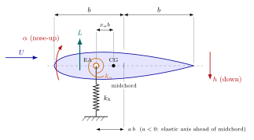
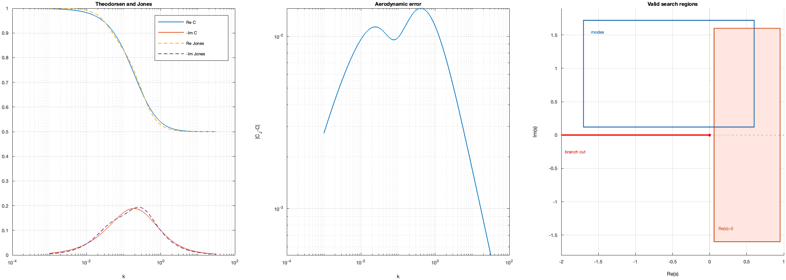
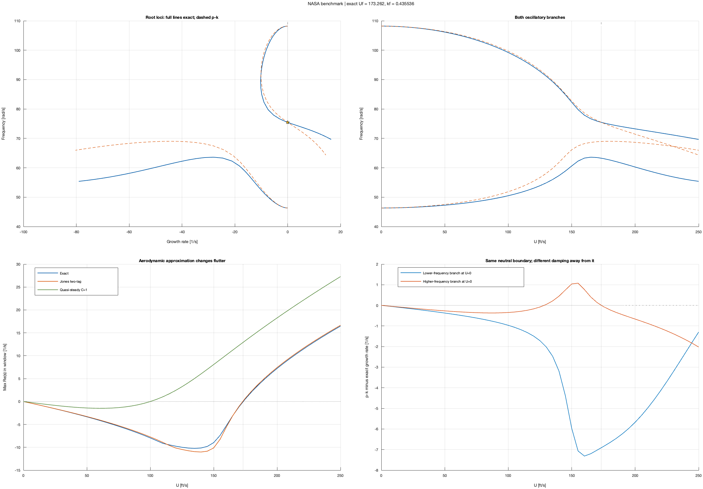
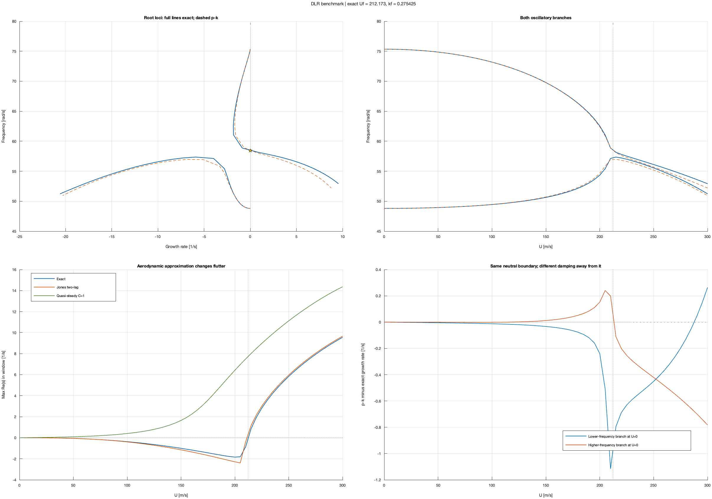
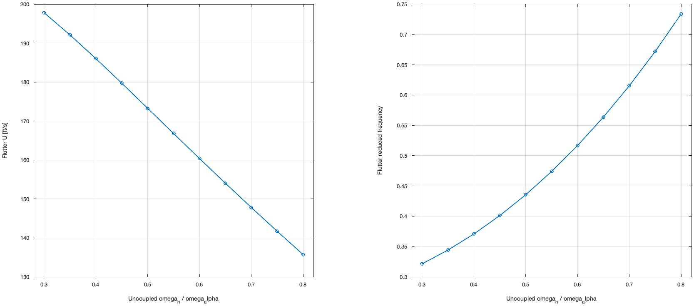

# Tutorial 9 — Flutter of a wing section, without rational approximations

**Goal:** decide whether a wing section is stable at a given airspeed, find
its flutter speed, and see what a rational approximation of the unsteady
aerodynamics changes. The aerodynamics are evaluated exactly (Theodorsen's
function, built from Bessel functions); no Padé, Jones or Roger
approximation is used.

**You need:** ContourRoots on the path and the example models:

```matlab
repo = fileparts(fileparts(which('croots')));
addpath(fullfile(repo, 'examples', 'models'))
```

No additional MATLAB toolbox is required. The complete script of Sections
9.4–9.6 is `examples/aeroelasticity/flutter_quickstart.m`; Chapter 10 of the
[manual](../ContourRoots_manual.pdf) gives the same material in article form.

## 9.1 Flutter is a feedback-stability problem

Think of the wing section as a plant: a two-degree-of-freedom mass-spring
system (plunge $h$ and pitch $\alpha$). The air closes a loop around it:
motion produces aerodynamic forces, which produce motion. Above a critical
airspeed the loop becomes unstable, and the section oscillates with growing
amplitude. That is **flutter**.

In the Laplace domain the loop gives a $2\times2$ *dynamic stiffness matrix*

$$D(s,U) = s^2 M + K - A(s,U), \qquad D(s,U)\,q(s) = 0,$$

with mass $M$, stiffness $K$ and aerodynamic matrix $A$. The modes are the
roots of the **characteristic function**

$$\Delta(s,U) = \det D(s,U),$$

exactly as the poles of a state-space model are the roots of
$\det(sI - A)$. The difference is that $A(s,U)$ is **not rational**: it
contains Theodorsen's function $C$, which describes the memory of the wake
and is built from Bessel functions. There is no finite state-space model
with exactly these roots.

The usual practice replaces $C$ by a rational function (R.T. Jones'
two-lag approximation, Roger's rational function approximation, or a Padé
fit), adds "aerodynamic lag states", and computes eigenvalues. This works
well in many cases, but it changes the equation being solved, in the same
way as a Padé approximation of $e^{-sT}$ does
([Tutorial 6](06_pade_pitfalls.md)). With ContourRoots, $\Delta(s,U)$ is
used as it is.

## 9.2 The model



The section has semichord $b$ (chord $2b$). The elastic axis (EA), where
the springs act, is at $a\,b$ from midchord ($a<0$: ahead of midchord), and
the centre of gravity is $x_\alpha b$ behind the EA. Plunge $h$ is positive
downwards, pitch $\alpha$ positive nose-up; all quantities are per unit
span. With $q = [h,\ \alpha]^T$, $S_\alpha = m\,x_\alpha b$ and
$I_\alpha = m\,r_\alpha^2 b^2$:

$$M\ddot q + K q = \begin{bmatrix}-L\\ M_a\end{bmatrix}, \qquad
M = \begin{bmatrix} m & S_\alpha\\ S_\alpha & I_\alpha\end{bmatrix}, \qquad
K = \begin{bmatrix} k_h & 0\\ 0 & k_\alpha\end{bmatrix},$$

where $L$ is the lift (upwards) and $M_a$ the nose-up aerodynamic moment
about the EA. Theodorsen's classical theory (incompressible, inviscid,
two-dimensional flow, small motions) gives, for a motion $e^{st}$,

$$L = \pi\rho b^2\,[s^2 h + U s\alpha - a b s^2\alpha]
      + 2\pi\rho U b\; C(p)\, w,$$

$$M_a = \pi\rho b^2\,[a b s^2 h - U b(\tfrac12 - a)s\alpha
        - b^2(\tfrac18 + a^2)s^2\alpha]
        + 2\pi\rho U b^2(a + \tfrac12)\; C(p)\, w,$$

with $w = s h + [U + b(\tfrac12 - a)s]\alpha$ the downwash at the
three-quarter-chord point and $p = sb/U$ the reduced Laplace variable. The
first bracket in each load is the *non-circulatory* part (added mass and
damping of the air); the second is the *circulatory* part, where the wake
memory enters through $C(p)$.

`aeroelastic_section('nasa')` returns $M$, $K$, $b$, $a$ and $\rho$ for the
standard test case of NASA/TP-2015-218765 (Section 9.8), and
`aeroelastic_delta(s, U, model)` evaluates $\Delta(s,U)$:

```matlab
model = aeroelastic_section('nasa');
Delta = @(s, U) aeroelastic_delta(s, U, model);
Delta(75i, 170)                 % a complex number, like det(D) in MATLAB
```

(`aeroelastic_delta` returns the determinant of $D$ scaled by a constant
matrix, which improves conditioning without moving the roots. Never use
`abs(det(D))`, `norm(D)` or singular values as the function passed to
`croots`: they are not analytic.)

## 9.3 Theodorsen's function and where it is defined

In the Laplace domain, Theodorsen's function is

$$C(p) = \frac{K_1(p)}{K_0(p) + K_1(p)}, \qquad p = \frac{sb}{U},$$

where $K_0$ and $K_1$ are modified Bessel functions (`besselk`). On the
imaginary axis, $p = ik$ with the reduced frequency $k = \omega b/U$, it is
the familiar $C(k) = H_1^{(2)}(k)/[H_1^{(2)}(k) + iH_0^{(2)}(k)]$ of flutter
textbooks. Its steady value is $C(0) = 1$ and its high-frequency limit
$1/2$.

$C$ is analytic everywhere **except on the negative real axis**, which is a
branch cut (a line where the function jumps). This is the one thing to
remember when choosing a search region: the rectangle must not touch that
line. Two kinds of rectangles are therefore safe:

- **the right half-plane**, $\mathrm{Re}\,s > 0$ (it contains the positive
  real axis, where there is no cut) — to count unstable roots;
- **the upper half-plane**, $\mathrm{Im}\,s > 0$ — to see the stable
  oscillatory modes. The coefficients are real, so the roots in the lower
  half-plane are the complex conjugates.



## 9.4 Step 1 — Is the section stable at a given speed?

Count the roots with positive real part. This is the direct analogue of
checking `any(real(eig(A)) > 0)` for a state-space model:

```matlab
rhp = [1e-3 60 -250 250];                  % Re(s) > 0: no branch cut here
[p, info] = croots(@(s) Delta(s, 170), rhp, 'AssumeAnalytic', true);
numel(p), info.status                      % 0 unstable roots, numerically_complete
[p, info] = croots(@(s) Delta(s, 180), rhp, 'AssumeAnalytic', true);
p                                          % 2.132 +- 74.78i: flutter
```

At 170 ft/s there is no root with $\mathrm{Re}\,s > 0$ in the window: the
section is stable. At 180 ft/s a pair has crossed into the right
half-plane, with growth rate $2.13\ \mathrm{s}^{-1}$ at $74.8$ rad/s.

Two practical points:

- **Why is the window finite?** For large $|s|$ the inertia terms
  dominate ($D \approx s^2(M + M_{\text{air}})$), so $\Delta$ has no roots
  there. A window of a few times the structural frequencies is enough;
  enlarging it (for example to `[1e-3 500 -2000 2000]`) is a cheap check.
- **Near the stability boundary** a mode is almost on the imaginary axis,
  i.e. almost on the left edge of the window, and the count needs a finer
  contour. ContourRoots then answers `unresolved` rather than guess;
  increase `ContourRefinements`:

```matlab
[~, info] = croots(@(s) Delta(s, 173), rhp, 'AssumeAnalytic', true);
info.status                                % unresolved: a mode is at Re(s) = -0.03
[p, info] = croots(@(s) Delta(s, 173), rhp, 'AssumeAnalytic', true, ...
    'ContourRefinements', 10);
info.status, numel(p)                      % numerically_complete, 0: still stable
```

The same happens at very low speed, where the air adds almost no damping
and all modes sit close to the imaginary axis.

## 9.5 Step 2 — Where are the modes?

To see frequencies and damping, search the upper half-plane:

```matlab
upper = [-100 50 0.5 180];
modes = croots(@(s) Delta(s, 170), upper, 'AssumeAnalytic', true);
zeta = -real(modes)./abs(modes);           % damping ratios
table(modes, abs(modes), zeta, 'VariableNames', {'Root', 'Wn', 'Zeta'})
```

| Root | $\omega_n$ [rad/s] | $\zeta$ |
|---|---:|---:|
| $-1.1504 + 75.8683i$ | 75.88 | 0.015 |
| $-31.4233 + 63.4831i$ | 70.83 | 0.444 |

The lightly damped mode is the one that will flutter. (These are modes of
the aeroelastic system, i.e. roots of $\Delta$; a particular input/output
transfer function may not show all of them —
see [Tutorial 2](02_poles_and_zeros.md).)

## 9.6 Step 3 — Root locus in the airspeed and flutter speed

Varying $U$ is like varying the gain in a root locus:

```matlab
speeds = 0:20:240;
figure, hold on
for U = speeds
    r = croots(@(s) Delta(s, U), upper, 'AssumeAnalytic', true);
    plot(real(r), imag(r), 'o', 'MarkerFaceColor', [U/250 0.3 1-U/250], ...
        'MarkerEdgeColor', 'none')
end
xline(0, ':'), grid on, xlabel('Re(s) [1/s]'), ylabel('Im(s) [rad/s]')
```

The flutter speed is where the largest real part — the *spectral abscissa*
— crosses zero, so `fzero` finds it:

```matlab
alpha = @(U) max(real(croots(@(s) Delta(s, U), upper, 'AssumeAnalytic', true)));
Uf = fzero(alpha, [150 200])               % 173.2624 ft/s
```

| Quantity | NASA/TP-2015-218765, Table CI | ContourRoots |
|---|---:|---:|
| Flutter speed $U_f$ | 173.26 ft/s | 173.2624 ft/s |
| Reduced frequency $k_f = \omega_f b/U_f$ | 0.4355 | 0.43554 |
| Flutter frequency $\omega_f$ | — | 75.462 rad/s |

The published values are reproduced at their printed precision. They are
never used as starting points.



The example models also contain `aeroelastic_flutter(model)`, which solves
the two real equations $\mathrm{Re}\,\Delta(i\omega,U) = 0$,
$\mathrm{Im}\,\Delta(i\omega,U) = 0$ directly for $(\omega, U)$ with
Newton's method, and returns $\mathrm{Re}(ds/dU) > 0$ at the crossing
(the mode moves into the right half-plane as the speed increases):

```matlab
f = aeroelastic_flutter(model);
[f.U f.omega f.k f.crossingSpeed]
```

## 9.7 Static divergence: a real unstable root

At high speed the section can also *diverge*: the aerodynamic moment
overcomes the torsional stiffness, and a **real** root crosses into the
right half-plane through $s = 0$. With $C(0) = 1$ the divergence speed is

$$U_d = \sqrt{\frac{k_\alpha}{2\pi\rho b^2(a + \tfrac12)}} \qquad (a > -\tfrac12),$$

353.55 ft/s for the NASA case, well above flutter. Real roots are invisible
to the upper-half-plane window, but not to the right-half-plane count:

```matlab
Ud = sqrt(model.K(2,2)/(2*pi*model.rho*model.b^2*(0.5 + model.a)));
p = croots(@(s) Delta(s, 1.05*Ud), [1e-3 200 -300 300], ...
    'AssumeAnalytic', true, 'ContourRefinements', 10)   % includes a real root 1.888
```

This is why Step 1 uses the right half-plane: it answers the stability
question for oscillatory **and** non-oscillatory instabilities at once.

## 9.8 The benchmarks

**NASA standard case** (Perry, NASA/TP-2015-218765, Appendix C, a
recomputation of the flexure–torsion case of NACA Report 496):

| Parameter | Value |
|---|---:|
| Inverse mass ratio $\pi\rho b^2/m$ | 0.1 |
| Elastic axis $a$ | −0.4 |
| CG offset $x_\alpha$ | 0.2 |
| Radius of gyration squared $r_\alpha^2$ | 0.25 |
| Uncoupled plunge frequency $\omega_h$ | 50 rad/s |
| Uncoupled pitch frequency $\omega_\alpha$ | 100 rad/s |
| Semichord $b$ | 1 ft |

Only these dimensionless ratios matter, so the model uses $\rho = 1$ and
$m = 10\pi\rho b^2$; with $b = 1$ ft the speeds are in ft/s. (The uncoupled
frequencies are $\sqrt{k_h/m}$ and $\sqrt{k_\alpha/I_\alpha}$, not the
frequencies of the coupled structure.)

**Dimensional case** (Kaiser and Quero, 2022, Table 1), in SI units:

| $m$ [kg/m] | $S_\alpha$ [kg] | $I_\alpha$ [kg m] | $k_h$ [N/m²] | $k_\alpha$ [N] | $b$ [m] | $a$ | $\rho$ [kg/m³] |
|---:|---:|---:|---:|---:|---:|---:|---:|
| 292.4823 | 73.1206 | 113.482 | 913960 | 419650 | 1 | −0.15 | 1.225 |

```matlab
second = aeroelastic_section('dlr');
f2 = aeroelastic_flutter(second);
f2.U                                       % 212.17 m/s (paper: 212.2 m/s)
```

The computed flutter speed, 212.173 m/s, rounds to the published 212.2 m/s
($\omega_f = 58.438$ rad/s, $k_f = 0.27542$); divergence is at 394.7 m/s.



## 9.9 What rational approximations change

**Jones' two-lag approximation.** Jones' classical approximation

$$C_J(p) = 1 - \frac{0.165\,p}{p + 0.0455} - \frac{0.335\,p}{p + 0.3}$$

is rational, so the aeroelastic system becomes a state-space model with
two aerodynamic lag states: six eigenvalues instead of an irrational
characteristic function. `aeroelastic_rational_roots` builds that model and
calls `eig`:

```matlab
rJ = aeroelastic_rational_roots(170, model, 'jones')
% -1.0467 +- 75.0313i, -32.4827 +- 66.1864i, and two real lag poles
```

Compared with the exact modes at 170 ft/s ($-1.1504 \pm 75.8683i$ and
$-31.4233 \pm 63.4831i$), the lightly damped mode has about 9% less damping
and a frequency 0.8 rad/s lower, and the model has two extra real roots
(-7.12 and -34.96) that are features of the approximation. The flutter
speed is nevertheless close:

| Benchmark | Exact $U_f$ | Jones $U_f$ | Difference |
|---|---:|---:|---:|
| NASA [ft/s] | 173.2624 | 172.8573 | −0.23% |
| Dimensional [m/s] | 212.1729 | 210.9854 | −0.56% |

A small error in the flutter speed does not imply small errors in damping
away from the boundary. The comparison is the aeroelastic counterpart of
[Tutorial 6](06_pade_pitfalls.md), but here the approximation is mild; the
point is that with ContourRoots you do not need it to know.

**Quasi-steady aerodynamics** ($C = 1$, keeping the non-circulatory terms)
ignores the wake memory entirely. For the NASA case it predicts flutter at
100.01 ft/s instead of 173.26 ft/s; for the dimensional case it is already
unstable at 0.01 m/s. Wake memory matters.

**The p-k method** evaluates the whole aerodynamic matrix at
$p = i\,\mathrm{Im}(s)\,b/U$, i.e. on the imaginary axis, while keeping
the complex $s$ in the structural terms (the definition of Kaiser and
Quero, Eq. (4)). At the flutter point ($s$ purely imaginary) it solves the
same equation as the exact method, so the flutter speeds agree; away from
it, the damping differs (lower-right panel of the NASA figure). The p-k
target is not an analytic function of $s$, so it is never passed to
`croots`; `aeroelastic_pk_roots` solves it with Newton's method instead.

## 9.10 A parameter study

Changing only the plunge stiffness ($\omega_h/\omega_\alpha$ from 0.30 to
0.80), with everything else fixed, moves the flutter speed of the NASA case
from 197.8 ft/s down to 135.7 ft/s: flutter becomes easier as the two
uncoupled frequencies approach each other. Each point is confirmed by
counts at 98% and 102% of its flutter speed.



## 9.11 How the results are checked

The complete study is `examples/aeroelasticity/run_aeroelastic_study.m`
(about two minutes; writes `output/aeroelasticity/`):

<!-- no-test -->
```matlab
addpath(fullfile(repo, 'examples', 'aeroelasticity'))
results = run_aeroelastic_study;
```

It checks, and `tests/regression/test_aeroelasticity.m` repeats the main
points:

1. **Published benchmarks:** NASA flutter speed and reduced frequency;
   the dimensional flutter speed.
2. **Aerodynamics:** the Bessel form of $C$ against the Hankel form on the
   imaginary axis; limits; conjugate symmetry; the lift and moment formulas
   of Section 9.2 assembled independently of the matrix implementation;
   the still-air added mass at $U = 0$.
3. **Roots:** a complete contour count with two modes in the upper window at
   every speed of the sweeps; enlarged windows and doubled contour sampling
   at selected speeds; a near-singular dynamic matrix at every root.
4. **Stability counts:** zero unstable roots below flutter and two above it
   at every speed where the count is conclusive; a real unstable root above
   divergence.
5. **Independent flutter solver:** a harmonic formulation (real reduced
   frequency $k$, eigenvalues in $U^2$ of $Kq = U^2 B(k)q$, Hankel
   functions) agrees with the Laplace-domain result to $10^{-6}$ in speed.
6. **Approximate models:** the Jones state-space eigenvalues are roots of
   the Jones characteristic function; exact and p-k equations coincide at
   flutter.

## 9.12 Scope and limitations

- The model is linear, incompressible, two-dimensional potential flow with
  small motions and a Kutta condition. "Exact" refers to evaluating this
  model without rational approximation, not to the physics of a real
  aircraft.
- Counts are complete **inside the stated rectangles**. The branch cut also
  contributes a non-exponential part to transient responses that roots do
  not describe; stability conclusions here concern the roots
  (eigenvalues) of the model.
- Counts close to the imaginary axis (very low speed, or within a fraction
  of a percent of flutter) may be inconclusive at default settings; they
  are then reported as `unresolved`, never guessed.
- `aeroelastic_flutter` and the harmonic solver search from finitely many
  starting points; the velocity sweep and the stability counts are the
  check that no earlier crossing was missed in the examined range.

## References

- B. Perry III (2015), *Re-Computation of Numerical Results Contained in
  NACA Report No. 496*, NASA/TP-2015-218765, Appendix C and Table CI.
  [NASA Technical Reports Server](https://ntrs.nasa.gov/citations/20150014000).
- J. W. Edwards (1977), *Unsteady Aerodynamic Modeling and Active
  Aeroelastic Control*, NASA-CR-148019 (generalized Theodorsen function,
  root loci, branch cut, rational approximations).
  [NASA Technical Reports Server](https://ntrs.nasa.gov/citations/19780002074).
- C. Kaiser and D. Quero (2022), *Effect of Aerodynamic Damping
  Approximations on Aeroelastic Eigensensitivities*, Aerospace 9(3), 127,
  Eq. (33) and Table 1. [doi:10.3390/aerospace9030127](https://doi.org/10.3390/aerospace9030127).

All numbers and figures of this tutorial are computed by ContourRoots; none
is copied from these references.
