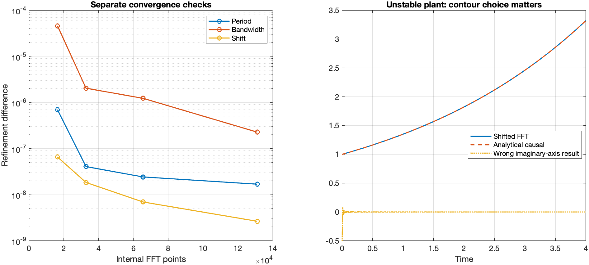
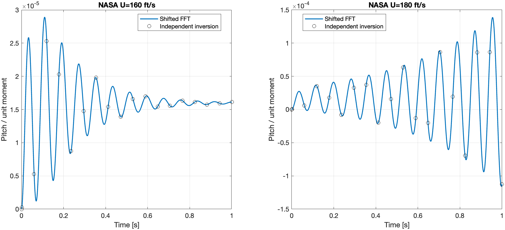
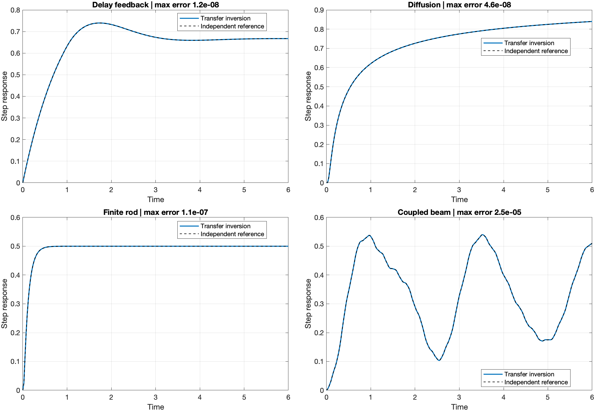

# Tutorial 10 — Time responses without rational approximations

**Goal:** compute impulse, step and forced responses of a nonrational
transfer function — a delay, a diffusion process, a beam, an aeroelastic
section — directly from $G(s)$, without first replacing it by a Padé or
modal state-space model.

**You need:** ContourRoots on the path. No additional toolbox (the
Control System Toolbox is used only for optional comparisons).

## 10.1 Why this is needed

For a rational model, MATLAB's `step`, `impulse` and `lsim` integrate a
state-space realization in time. A transfer function such as

$$G(s) = \frac{1}{s + 1 + 0.5\,e^{-s}}, \qquad
G(s) = e^{-a\sqrt s}, \qquad
G(s) = [\,0\ \ 1\,]\,D(s,U)^{-1}\begin{bmatrix}0\\1\end{bmatrix}\ \text{(Tutorial 9)},$$

has **no** finite state-space realization. The usual workaround replaces
it by a rational approximation (Padé for delays, a truncated modal
expansion for PDEs, Jones or Roger approximations for aerodynamics) and
simulates that model instead. [Tutorial 6](06_pade_pitfalls.md) showed how
this can change stability conclusions; it can change transients too.

ContourRoots takes the other route: the response is the **inverse Laplace
transform** of $G(s)U(s)$, and that integral can be computed numerically
from values of $G$ on a vertical line of the complex plane:

$$y(t) = \frac{1}{2\pi i}\int_{\sigma - i\infty}^{\sigma + i\infty}
          e^{st}\,G(s)\,U(s)\,ds .$$

Only $G$ itself is evaluated. What is discretized is this integral, not
the physics — and the solver checks that the discretization has converged.

The functions mirror MATLAB's:

| MATLAB (rational models) | ContourRoots (any analytic $G$) |
|---|---|
| `impulse(sys,t)` | `cimpulse(G,t,...)` |
| `step(sys,t)` | `cstep(G,t,...)` |
| `lsim(sys,u,t)` | `clsim(G,u,t,...)` |
| — | `cinvlaplace(F,t,...)` for a complete $F(s) = G(s)U(s)$ |

As in MATLAB, calling them without output arguments plots the response.
With outputs they return column vectors and a diagnostics structure
(the third output is **diagnostics, not states**). All responses are
**zero-state**: the system starts at rest, including the "memory" of the
delay line, of the PDE or of the wake.

## 10.2 A first step response

The delayed feedback loop $\dot x = -x(t) - 0.5\,x(t-1) + u(t)$ has the
transfer function $G(s) = 1/(s + 1 + 0.5e^{-s})$:

```matlab
G = @(s) 1./(s + 1 + 0.5*exp(-s));
t = (0:0.02:8).';
[y, t, info] = cstep(G, t, 'SingularityBound', 0);
info.status                            % 'converged'
figure, plot(t, y), grid on, xlabel('t'), ylabel('step response')
```

The response rises, overshoots slightly and settles at
$G(0) = 1/1.5 = 0.667$ — the static gain, as it should.

The only non-obvious argument is `'SingularityBound',0`. It is the one
piece of information you must supply; the next section explains it.

## 10.3 The one assumption: where is $G$ analytic?

The inversion integral runs along a vertical line $\mathrm{Re}\,s = \sigma$
that must lie **to the right of every singularity** of $G$ (poles, branch
points, cuts). For a causal system this is always possible, and the right
half-plane beyond that line is where the Laplace transform converges. You
tell the solver where it may put the line:

- `'SingularityBound',a` — "$G$ is analytic for $\mathrm{Re}\,s > a$".
  The solver then picks $\sigma$ a little to the right of $\max(a, 0)$.
- `'Abscissa',sigma` — the line itself, if you prefer to choose it.

For **coefficient vectors and `tf` models** the bound is computed from the
poles automatically. For **function handles** it cannot be: MATLAB cannot
look inside `@(s) ...`, so you must supply it. How to justify it:

| Model | Bound | Why |
|---|---|---|
| $1/(s + 1 + 0.5e^{-s})$ | 0 | for $\mathrm{Re}\,s \ge 0$: $\lvert s+1\rvert \ge 1 > 0.5 \ge \lvert 0.5e^{-s}\rvert$, no poles |
| $e^{-a\sqrt s}$ (diffusion) | 0 | the only singularity is the branch cut on the negative real axis |
| $e^{-\tau s}/(s+1)$ | −1 | pole at −1; $e^{-\tau s}$ is entire |
| an unstable system | its growth rate | poles in the right half-plane must be left of the line |
| aeroelastic section above flutter | e.g. 5 | `croots` finds the unstable modes at $2.13 \pm 74.8i$ (Tutorial 9) |

For an unstable system the line **must** lie to the right of the unstable
poles. The solver handles the exponential growth; what it cannot do is
guess the bound. Choosing the imaginary axis for an unstable plant gives a
wrong, non-causal answer:

```matlab
t = (0:0.02:4).';
g = cimpulse(ndpair(1, [1 -0.3]), t);  % 1/(s - 0.3): bound 0.3 known from the pole
max(abs(g - exp(0.3*t)))                % about 1e-8
```



The right panel of the figure shows the correct causal response
$e^{0.3t}$ and, dotted, what an inverse FFT on the imaginary axis returns:
nothing like it. A finite `croots` or `cpoles` search is a good way to
*choose* a bound, but it cannot *prove* one (a pole outside the search
rectangle would be missed); the bound remains your assertion, and the
diagnostics record it in `info.domainSource`.

## 10.4 How the solver computes and checks the answer

On the line $s = \sigma + i\omega$, the inversion integral is a Fourier
integral of $e^{-\sigma t}y(t)$. With an FFT period $P$ and $N$ points,

$$\Delta\omega = \frac{2\pi}{P},\qquad \Delta t = \frac{P}{N},\qquad
y(t_n) \approx e^{\sigma t_n}\,\frac{\operatorname{IFFT}(Y_k)_n}{\Delta t}.$$

Two things can go wrong, and they are checked separately:

1. **Period too short.** The FFT sees the response as periodic; a response
   that has not decayed within the period "wraps around". The factor
   $e^{-\sigma t}$, with $\sigma$ chosen from the bound, makes the wrapped
   part tiny, and the solver doubles $P$ to confirm it.
2. **Bandwidth too small.** Fast features (a sharp corner, a delay jump,
   a high-frequency mode) need many frequencies. The solver doubles $N$
   at fixed period to confirm them.

A third check moves the line slightly to the right: the answer must not
depend on $\sigma$. A sample is accepted when two successive refinements
agree within `AbsTol + RelTol*|y|` (defaults $10^{-6}$ and $10^{-4}$). The
left panel of the figure shows the three differences decreasing for a
delayed first-order system.

These are careful numerical checks, not a proof (`info.certified` is always
false): a very narrow resonance outside the sampled band could be missed.

## 10.5 Arbitrary inputs

`clsim` works like `lsim`: give the input as samples (or as a handle, which
is sampled on the time grid) and say how to connect the samples:

```matlab
G = @(s) 1./(s + 1 + 0.5*exp(-s));
t = (0:0.02:8).';
u = sin(2*t).*exp(-t);
[y, ~, info] = clsim(G, u, t, 'SingularityBound', 0, 'Interpolation', 'foh');
info.status                            % 'converged'
figure, plot(t, u, '--', t, y), legend('input', 'output'), grid on
```

- `'foh'` (default): the input is linear between samples;
- `'zoh'`: the input is held constant on each interval (a D/A converter).

The response is exact for the chosen interpolant; ContourRoots does not
guess what the input did between samples. Internally it does not convolve
with a sampled impulse response (which may be infinite at $t = 0$, as for
diffusion). Instead, it uses the **step** response $S$ for ZOH and the
**ramp** response $R$ for FOH, both computed by inversion:

$$\text{ZOH:}\quad y(t) = \sum_{t_j \le t} (u_j - u_{j-1})\,S(t - t_j),\qquad u_{-1} = 0,$$

a sum of delayed steps, one per jump of the held input; FOH is the same
idea with delayed ramps, one per change of slope. For a rational model the
result agrees with MATLAB's `lsim` using the same hold:

```matlab
if license('test', 'Control_Toolbox')
    sys = tf([1 2], [1 0.4 4]);
    u2 = sin(2*t).*(t < 3) + 0.5;
    yz = clsim(ndpair([1 2], [1 0.4 4]), u2, t, 'Interpolation', 'zoh');
    max(abs(yz - lsim(sys, u2, t, 'zoh')))          % about 1e-10
end
```

## 10.6 Impulses, direct feedthrough and $t = 0$

**Direct feedthrough.** If $G(s) = D + G_r(s)$ with a constant $D$, the
impulse response contains $D\,\delta(t)$, which no vector of samples can
represent. `cimpulse` returns the ordinary part $g_r(t)$ and lists the
Dirac terms separately:

```matlab
[g, ~, info] = cimpulse(2, (0:0.1:1).');     % G(s) = 2
all(g == 0), info.singularTerms              % ordinary part 0; 2*delta(t)
```

For `tf`/`zpk` models and coefficient vectors, $D$, transport delays and
the value $g(0^+)$ are known exactly and used. For a **function handle**
they are not, and the solver needs your confirmation:

- `'RegularImpulse',true` states that the handle has an ordinary impulse
  response (no hidden Dirac terms); `cimpulse` requires it for handles;
- `'Feedthrough',D` gives a known direct term;
- `'InitialValue',g0` gives the right limit $g(0^+)$ when you know it.

Without `InitialValue`, the value at $t = 0$ is unknown and returned as
`NaN` (the other samples are unaffected). Impulse responses that are
infinite at zero, such as $g(t) = 1/\sqrt{\pi t}$ for $G = 1/\sqrt s$, are
handled by asking for positive times only:

```matlab
tp = logspace(-3, 1, 20).';
g = cimpulse(@(s) 1./sqrt(s), tp, 'RegularImpulse', true, ...
    'SingularityBound', 0, 'Method', 'dehoog');
max(abs(g.*sqrt(pi*tp) - 1))                 % about 1e-10
```

**Jumps.** A step through a transport delay jumps at the delay time. For a
`tf` model the jump time is known and handled exactly; inside a function
handle it is not, and the single sample that falls exactly on the jump
cannot converge (the inverse transform gives the midpoint of the jump).
The solver then marks that sample as unresolved and warns; the rest of
the response is accurate:

```matlab
t = (0:0.01:3).';
[y, ~, info] = cstep(@(s) exp(-0.7*s)./(s + 1), t, 'SingularityBound', -1, 'Warn', false);
t(~info.resolvedMask)                        % 0.7: the jump time only
exact = (t >= 0.7).*(1 - exp(-(t - 0.7)));
max(abs(y(info.resolvedMask) - exact(info.resolvedMask)))   % about 1e-9
```

## 10.7 Three inversion methods

| `Method` | Idea | Times | Use it for |
|---|---|---|---|
| `'fft'` (default) | shifted FFT on the Bromwich line | uniform grid | whole responses, fast |
| `'dehoog'` | accelerated series (de Hoog, Knight & Stokes, 1982) | any positive times | logarithmic time grids, cross-checks |
| `'quadrature'` | adaptive Gauss–Kronrod integration of the Bromwich integral | any positive times | independent checks, late oscillatory responses |

The three are independent; comparing two of them at a few times is a cheap
and convincing check. (The de Hoog method accelerates its series with a
Padé-type continued fraction. That is a numerical device for summing the
integral, not a rational approximation of $G$.) There is no automatic
switching: if a method cannot converge, it says so.

## 10.8 A known input transform: `cinvlaplace`

When the input has a simple Laplace transform, invert the product
directly. The bound must then cover the input's singularities too (for a
step, $1/s$ has a pole at 0):

```matlab
F = @(s) exp(-0.7*sqrt(s))./s;               % diffusion kernel times a step
td = [0; logspace(-2, 1, 25).'];
[f, ~, info] = cinvlaplace(F, td, 'InitialValue', 0, ...
    'SingularityBound', 0, 'Method', 'dehoog');
max(abs(f(2:end) - erfc(0.7./(2*sqrt(td(2:end))))))   % about 1e-10
```

## 10.9 Application: pitch response of a wing section

In [Tutorial 9](09_aeroelasticity.md), the NASA wing section flutters at
173.26 ft/s. Its pitch response to a step pitch moment follows from the
dynamic stiffness matrix: $q(s) = D(s,U)^{-1}[0;1]\,M(s)$, so the transfer
function is the second entry of $D^{-1}[0;1]$ — with exact Theodorsen
aerodynamics, no aerodynamic lag states:

```matlab
repo = fileparts(fileparts(which('croots')));
addpath(fullfile(repo, 'examples', 'models'))
model = aeroelastic_section('nasa');
pitch = @(s, U) arrayfun(@(z) [0 1]*(aeroelastic_matrix(z, U, model)\[0; 1]), s);
t = (0:0.005:1).';
yBelow = cstep(@(s) pitch(s, 160), t, 'SingularityBound', 5);
yAbove = cstep(@(s) pitch(s, 180), t, 'SingularityBound', 5);
figure, plot(t, yBelow, t, yAbove), grid on
legend('160 ft/s (below flutter)', '180 ft/s (above flutter)')
xlabel('t [s]'), ylabel('pitch per unit moment')
```

The bound 5 lies to the right of the unstable pair $2.13 \pm 74.8i$ found at
180 ft/s by the right-half-plane count of Tutorial 9. Below flutter the
oscillation decays to the static deflection; above flutter it grows at the
predicted rate. Each curve takes a few seconds.



## 10.10 Reading the diagnostics

| Field | Meaning |
|---|---|
| `info.status`, `info.converged` | `'converged'` when every sample passed the checks |
| `info.resolvedMask` | which samples passed (e.g. all but a jump time) |
| `info.errorEstimate` | per-sample size of the last refinement differences |
| `info.abscissa`, `info.domainSource` | the line used and where its validity came from |
| `info.singularTerms` | known Dirac terms: time, order, weight |
| `info.history`, `info.stopReason` | what the refinement did and why it stopped |

An unresolved response always warns (even when `info` is requested);
`'Warn',false` only silences the message. All fields and options are in
[Options and diagnostics](../api/time_response_options.md).

## 10.11 How the module was validated



The study `examples/time_response/run_time_response_study.m` compares step
responses computed from the transfer function with references obtained
by entirely different means:

| Case | Independent reference | Max. error |
|---|---|---:|
| delayed feedback $1/(s+1+0.5e^{-s})$ | method-of-steps series | $1.2\times10^{-8}$ |
| diffusion $e^{-0.7\sqrt s}$ | $\operatorname{erfc}$ formula | $4.6\times10^{-8}$ |
| heat equation in a rod | separation of variables, 150 modes | $1.1\times10^{-7}$ |
| beam coupled to an oscillator (Tutorial 8) | finite elements, 32 elements | $2.5\times10^{-5}$ |
| aeroelastic pitch, 160 and 180 ft/s | FFT versus quadrature | $< 10^{-10}$ |

(The beam error is that of the finite-element reference itself.) The
regression tests add analytical first-order, delayed, unstable, marginal
and fractional cases, and MATLAB's `lsim` for ZOH and FOH inputs.

<!-- no-test -->
```matlab
addpath(fullfile(repo, 'examples', 'time_response'))
results = run_time_response_study;   % about 1 minute; writes output/time_response/
```

Short scripts: `first_step.m`, `arbitrary_input.m`,
`delays_and_diffusion.m` and `unstable_response.m` in `examples/time_response/`.

## 10.12 Scope and limitations

- Zero initial state and prehistory. A transfer function does not
  describe an arbitrary internal initial state (of a PDE, of a delay
  line), so there is no analogue of MATLAB's `initial`.
- Real SISO responses; a matrix model needs the transfer of the chosen
  input/output channel, as in Section 10.9 — not its determinant.
- The inversion half-plane is your assertion for function handles.
- The input is the stated ZOH/FOH interpolant of its samples.
- Jumps and corners at times unknown to the solver leave the sample at
  that time unresolved.
- Results are numerically converged, not certified; a feature outside the
  sampled bandwidth cannot be excluded.

References: F. R. de Hoog, J. H. Knight, A. N. Stokes (1982), *An improved
method for numerical inversion of Laplace transforms*, SIAM J. Sci. Stat.
Comput. 3(3), 357–366, [doi:10.1137/0903022](https://doi.org/10.1137/0903022).
The de Hoog recurrence is adapted from mpmath (BSD-3-Clause); see
[THIRD_PARTY_NOTICES.md](../../THIRD_PARTY_NOTICES.md).
