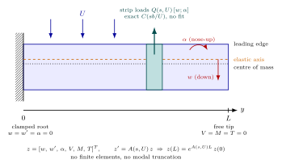
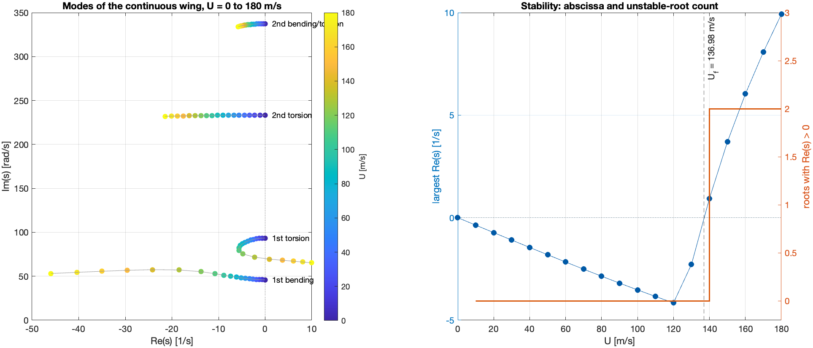
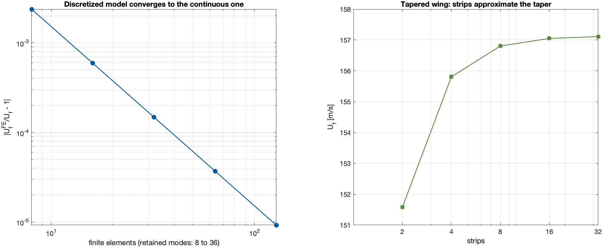
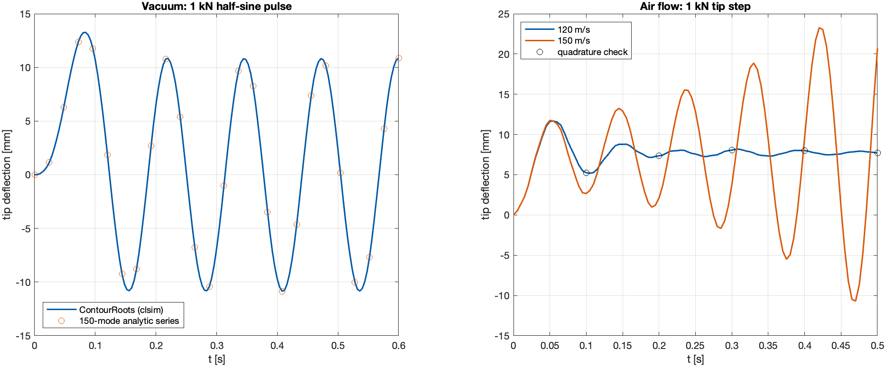

# Tutorial 11 — Flutter of a continuous wing, with nothing discretized

[Tutorial 9](09_aeroelasticity.md) found the flutter speed of a *wing
section*: two degrees of freedom and exact Theodorsen aerodynamics. A real
wing is a flexible beam. It bends and twists along its span, and it has
infinitely many modes. This tutorial computes the poles, the stability and
the flutter speed of such a wing. It uses the classical Goland wing, a
uniform cantilever. The calculation makes **no approximation of either
ingredient**:

- the **structure is not discretized**. There are no finite elements and no
  truncation to a few vibration modes. The bending and torsion equations
  are solved exactly along the span;
- **Theodorsen's function is not approximated**. There is no rational fit
  (Roger, Karpel, Jones) and no table of reduced frequencies: $C(p)$ is
  evaluated from Bessel functions at every complex $s$.

The usual workflow involves two separate approximations, each with its own
convergence question:

1. build a finite-element model;
2. keep $N$ modes (*are $N$ modes enough?*);
3. tabulate the aerodynamic forces at a few reduced frequencies;
4. fit a rational function (*is the fit good enough, and does it add
   spurious poles?*);
5. assemble a large state-space model and call `eig`.

Here there is one exact characteristic function $\Delta(s,U)$, and
ContourRoots finds its zeros. Stability is decided by **counting** the
zeros in the right half-plane, as in Tutorial 9. The time response comes
from the same continuous model. The result is a reference solution: a
finite-element model is shown to converge to it as the mesh is refined
(Section 11.7).

The complete script is `examples/continuous_wing/wing_quickstart.m`
(about 30 s). The study that produces every figure and table is
`run_continuous_wing_study.m` in the same folder.

## 11.1 The model



The wing is a straight cantilever of span $L$. At each spanwise position
$y$, a chordwise section moves with two displacements:
- the plunge $w(y,t)$, positive downward, at the elastic axis;
- the pitch $\alpha(y,t)$, nose-up.

The structure is an Euler–Bernoulli beam in bending (stiffness $EI$) and a
Saint-Venant bar in torsion (stiffness $GJ$). They are coupled by inertia:
the centre of mass lies a distance $x_\alpha b$ behind the elastic axis,
which gives a static moment $S = \mu x_\alpha b$ per unit span. After a
Laplace transform in time, the section equations are

$$EI\,w'''' + s^2(\mu w + S\alpha) = Q_{11}w + Q_{12}\alpha,\qquad
-GJ\,\alpha'' + s^2(S w + I_\alpha\alpha) = Q_{21}w + Q_{22}\alpha,$$

with $' = d/dy$. The right-hand side is the unsteady air load on the strip.
It is the same **exact Theodorsen** load as in Tutorial 9, with the
circulatory part multiplied by $C(sb/U) = K_1/(K_0+K_1)$. It is computed
by `theodorsen_loads`, which the section model of Tutorial 9 now shares.
Each spanwise strip is treated as a two-dimensional airfoil (strip theory);
this is the only aerodynamic modelling assumption. Section 11.10 discusses
it.

The Goland wing is rectangular and uniform:

| Quantity | Value |
|---|---|
| span $L$, semichord $b$ | 6.096 m, 0.9144 m |
| $EI$, $GJ$ | $9.773\times10^6$ N m², $9.876\times10^5$ N m² |
| mass $\mu$, pitch inertia $I_\alpha$ (per unit span) | 35.717 kg/m, 8.642 kg m |
| elastic axis, centre of mass | 33 % and 43 % of the chord |
| air density $\rho$ | 1.225 kg/m³ |

## 11.2 From partial differential equations to one characteristic function

The trick is to read the section equations as an **ordinary differential
equation in the span coordinate $y$**, with $s$ as a parameter. Collect
displacement, slope, twist, shear force, bending moment and torque in a
state vector:

$$z(y) = [\,w,\; w',\; \alpha,\; V,\; M,\; T\,]^T,\qquad
M = EI\,w'',\quad V = -M',\quad T = GJ\,\alpha'.$$

Then $z' = A(s,U)\,z$ with a constant $6\times6$ matrix. On a span of
constant properties the solution is **exact**:

$$z(L) = e^{A(s,U)L}\,z(0).$$

This matrix exponential takes the place of the finite-element model. It is
the exact solution of the beam equations, for every $s$.

Six boundary conditions remain: the root is clamped
($w = w' = \alpha = 0$) and the tip is free ($V = M = T = 0$). Together
with $z(L) = e^{AL}z(0)$ they form a square homogeneous linear system
$K(s,U)\,x = 0$. It has a nonzero solution, a mode, exactly when

$$\Delta(s,U) = \det K(s,U) = 0.$$

$\Delta$ plays the role of $\det(sI-A)$ for this infinite-dimensional
system. Its zeros are **all** the aeroelastic modes: infinitely many, of
which ContourRoots finds those inside a chosen rectangle. The functions
are:

| Function (`examples/models`) | Returns |
|---|---|
| `wing_model(kind, N)` | parameters of `'goland'`, `'dry'` (vacuum, uncoupled) or `'tapered'` |
| `wing_propagator(s,U,strip,scale)` | $e^{A\ell}$ for one strip of length $\ell$ |
| `wing_matrix(s,U,wing)` | $K(s,U)$ |
| `wing_delta(s,U,wing)` | $\Delta(s,U) = \det K$ |
| `wing_transfer(s,U,wing,out,in)` | tip transfer function, e.g. force → deflection |
| `theodorsen_loads(s,U,b,a,rho)` | exact strip loads $Q(s,U)$ |

Three details keep $\Delta$ well-behaved:

- **It is analytic.** The matrix exponential is an entire function of the
  entries of $A$. With air, those entries contain $C(sb/U)$, which is
  analytic everywhere except on the negative real axis (Tutorial 9,
  Section 9.3). So `'AssumeAnalytic',true` is justified in any rectangle
  that avoids that axis.
- **Nothing is inverted.** $K$ keeps the states at the root and the tip as
  unknowns. Eliminating some of them (a "condensed" or transfer-matrix
  determinant) would divide by functions of $s$. That creates artificial
  poles, which a pole–zero count would then have to account for.
- **The states are scaled by fixed constants**, independent of $s$. This
  conditions $K$ better without changing where it is singular.
  (`wing_model` stores the scales.)

## 11.3 Step 1 — check in vacuum: exact beam frequencies

Without air and without the inertial coupling ($S = 0$), bending and
torsion separate, and the natural frequencies of a cantilever are known in
closed form:
- bending: $\beta_n^2\sqrt{EI/\mu}/L^2$, with $\beta_1 = 1.8751$ and
  $\beta_2 = 4.6941$;
- torsion: $(2n-1)\pi/(2L)\,\sqrt{GJ/I_\alpha}$.

```matlab
repo = fileparts(fileparts(which('croots')));
addpath(fullfile(repo, 'examples', 'models'))
wing  = wing_model('goland');
Delta = @(s, U) wing_delta(s, U, wing);

dry = wing_model('dry');                          % no air, no bending-torsion coupling
r = croots(@(s) wing_delta(s, 0, dry), [-2 2 1 320], 'AssumeAnalytic', true);
e = dry.strips;  L = dry.L;
bending = [1.875104068711961 4.694091132974174].^2*sqrt(e.EI/e.mu)/L^2;
torsion = [1 3]*pi/(2*L)*sqrt(e.GJ/e.Ialpha);
exact = sort([bending torsion]).';
table(exact, sort(imag(r)), 'VariableNames', {'closed_form', 'croots'})
```

The four frequencies below 320 rad/s agree with the formulas to
$10^{-13}$ or better: 49.49 and 310.16 rad/s in bending, 87.11 and 261.32 rad/s in
torsion. This is what "no discretization" means in practice. A
finite-element model gives these numbers only in the limit of a fine
mesh; the continuous model gives them to rounding error.

## 11.4 Step 2 — Is the wing stable? Count the unstable roots

As for the section, the question "is it stable?" becomes "how many zeros of
$\Delta$ have $\mathrm{Re}\,s > 0$?". Theodorsen's branch cut lies on the
negative real axis, so a rectangle in the right half-plane is a valid
search region, **including the real axis**. A real unstable root, static
divergence, would be counted too.

```matlab
rhp = [1e-3 60 -400 400];
for U = [120 150]
    [p, info] = croots(@(s) Delta(s, U), rhp, 'AssumeAnalytic', true);
    fprintf('U = %3d m/s: %d unstable roots (%s)\n', U, numel(p), info.status);
end
```

```text
U = 120 m/s: 0 unstable roots (numerically_complete)
U = 150 m/s: 2 unstable roots (numerically_complete)
```

At 150 m/s a complex pair, $3.70 \pm 68.2i$, has crossed into the right
half-plane: the wing flutters. Each count takes a fraction of a second,
because ContourRoots only evaluates $\Delta$ on the boundary of the
rectangle and on its subdivisions.

The count is complete for the chosen rectangle and conditional on
analyticity, as always. A larger rectangle, up to 700 rad/s, was also
checked just below and above flutter: it contains six upper-half-plane
modes, and none of the extra ones is unstable (Section 11.9).

## 11.5 Step 3 — Root locus in the airspeed and flutter speed



The left panel follows the four lowest modes from 0 to 180 m/s. In still
air they are, from bottom to top:
- the first bending mode, 46 rad/s;
- the first torsion mode, 93 rad/s;
- the second torsion mode, 233 rad/s;
- a strongly coupled mode, 337 rad/s.

As the speed grows, the first torsion branch falls towards the bending
frequency and turns to the right. It crosses the imaginary axis near
70 rad/s: this is the classical **bending–torsion flutter**. The first
bending branch, in turn, becomes strongly damped. The right panel shows
the two stability indicators:
- the largest real part of the modes (the *spectral abscissa*);
- the number of roots counted in the right half-plane, which jumps from 0
  to 2 at the flutter speed.

The flutter speed is where the spectral abscissa crosses zero, exactly as
in Tutorial 9:

```matlab
window = [-60 35 1 380];                          % above the branch cut
alpha  = @(U) max(real(croots(@(s) Delta(s, U), window, 'AssumeAnalytic', true)));
Uf = fzero(alpha, [120 150]);
p  = croots(@(s) Delta(s, Uf), window, 'AssumeAnalytic', true);
[~, k] = max(real(p));
fprintf('Flutter: U = %.4f m/s, omega = %.4f rad/s\n', Uf, imag(p(k)));
```

```text
Flutter: U = 136.9840 m/s, omega = 70.0330 rad/s
```

This takes about 5 s. A local Newton solution of
$\Delta(i\omega,U) = 0$ in the two real unknowns $(U,\omega)$ gives
136.983977449 m/s and 70.033012953 rad/s, agreeing to $10^{-9}$. The
values usually quoted for the Goland wing, about 137 m/s and 70 rad/s,
come from models with a few modes.

## 11.6 Why this is not a discretization in disguise

Two things in the code could look like a discretization. Neither is.

**The strips of a uniform wing.** `wing_model('goland', N)` splits the
span into $N$ strips with a propagator each. For a uniform wing the
strips are identical, and $e^{A L} = (e^{A L/N})^N$ exactly: the model
does not change. The study evaluates $\Delta$ with 1, 2, 4 and 8 strips;
the values agree to $1.4\times10^{-14}$. Strips are needed only when the
properties really vary along the span (Section 11.7).

**The subdivision inside `wing_transfer`.** At high frequency a bending
wave grows or decays like $e^{\kappa y}$ with $\kappa = (|s|^2\mu/EI)^{1/4}$.
Across the whole span that factor becomes numerically huge. At the
$10^4$ rad/s used by the time responses, $\kappa L \approx 27$ and
$e^{\kappa L} \approx 10^{12}$. `wing_transfer` therefore splits each strip
into as many identical pieces as needed to keep every exponential below
about $e^3$. This is the classical *multiple shooting* remedy for stiff
boundary-value problems. Again it is exact: results with $n$ and $2n$
pieces agree to $10^{-12}$. It only keeps the linear solve well
conditioned.

## 11.7 A finite-element model converges to this answer



The most convincing check compares with the usual route, carried out
**independently**:
- cubic-Hermite beam elements for bending and linear elements for torsion
  (`wing_fem`);
- projection onto the vacuum modes;
- air loads assembled from Theodorsen's original lift and moment formulas,
  with $C(k)$ written in Hankel functions (`theodorsen_loads_hankel`), not
  in the modified Bessel functions of the main model.

| Finite elements | Retained modes | Flutter speed (m/s) | Relative difference |
|---:|---:|---:|---:|
| 8 | 8 | 137.308301 | $2.4\times10^{-3}$ |
| 16 | 12 | 137.065051 | $5.9\times10^{-4}$ |
| 32 | 20 | 137.004259 | $1.5\times10^{-4}$ |
| 64 | 28 | 136.989048 | $3.7\times10^{-5}$ |
| 128 | 36 | 136.985245 | $9.3\times10^{-6}$ |
| continuous (ContourRoots) | — | **136.983977** | — |

The discretized model approaches the continuous result from above, and
the error falls by a factor of 4 each time the mesh is doubled: clean
second-order convergence (left panel). ContourRoots gives the limit of this
sequence directly, from a model with no mesh and no modes to choose.

**A tapered wing is different.** When chord, stiffness and inertia vary
along the span, piecewise-constant strips *do* approximate the geometry.
The synthetic tapered wing of `wing_model('tapered', N)` gives:

| strips $N$ | 2 | 4 | 8 | 16 | 32 |
|---|---:|---:|---:|---:|---:|
| flutter speed (m/s) | 151.58 | 155.81 | 156.81 | 157.05 | 157.11 |

These values converge as the strips are refined (right panel). The error
comes only from how the taper is represented. Within each strip the
solution is still exact, and there is still no modal truncation and no
aerodynamic fit.

## 11.8 Time responses from the same model

The transfer function from a tip force to the tip deflection is available
at any complex $s$ (`wing_transfer`). `cstep` of [Tutorial 10](10_time_response.md)
therefore gives the response directly, with no modal ODE and no
aerodynamic lag states.

Two choices matter:

- **Units and tolerances.** The deflection per newton is about
  $10^{-5}$ m, as small as the default `AbsTol` of $10^{-6}$. Scale the
  transfer to a convenient unit, here mm per kN, and state the
  tolerances in that unit: `AbsTol = 1e-3` is one micrometre.
- **The inversion line.** It must lie to the right of every singularity.
  Step 2 counted no unstable root at 120 m/s and one pair with
  $\mathrm{Re}\,s = 3.70$ at 150 m/s, so `SingularityBound = 5` is safe for
  both speeds. This is a counted rectangle, not a proof over the infinite
  spectrum. `info.certified` stays false.

```matlab
tip = @(U) @(s) 1e6*wing_transfer(s, U, wing, 1, 1);   % mm per kN
t = (0:0.005:0.5).';
opts = {'SingularityBound', 5, 'AbsTol', 1e-3, 'RelTol', 1e-3};
wBelow = cstep(tip(120), t, opts{:});                  % 1 kN step at the tip
wAbove = cstep(tip(150), t, opts{:});
figure, plot(t, wBelow, t, wAbove), grid on
legend('120 m/s (below flutter)', '150 m/s (above flutter)', 'Location', 'northwest')
xlabel('t [s]'), ylabel('tip deflection [mm]')
```



The left panel checks the inversion in vacuum. The response to a 1 kN
half-sine pulse agrees with an analytic 150-mode series to
$1.9\times10^{-6}$ mm, on a 13 mm response. On the right, below flutter the
tip settles to its static deflection of about 7.7 mm. Above flutter the
oscillation grows at the rate $\mathrm{Re}\,s = 3.70$ predicted by the
root count. Adaptive quadrature (`'Method','quadrature'`, circles)
reproduces the FFT result to $7\times10^{-4}$ mm. Each response takes
about 10 s.

This response is also a severe test of the inversion methods. The wing has
many lightly damped modes close to the imaginary axis. The de Hoog method
(`'Method','dehoog'`) settles here on a slightly wrong plateau, off by
0.04 mm, and still reports convergence. Use the default FFT, and
cross-check with `'quadrature'` (see [Tutorial 10, Section 10.7](10_time_response.md#107-three-inversion-methods)).

## 11.9 How the results are checked

| Check | Result |
|---|---|
| vacuum frequencies vs closed form (8 modes below 900 rad/s) | $\le 4\times10^{-14}$ relative |
| uniform wing, 1/2/4/8 strips | $\Delta$ identical to $1.4\times10^{-14}$ |
| static tip flexibility vs $L^3/3EI$, $L^2/2EI$, $L/EI$, $L/GJ$ | $10^{-12}$ |
| exact strip loads vs Hankel-form lift and moment | $10^{-12}$ |
| flutter by `fzero` on the spectral abscissa vs local Newton | $10^{-9}$ |
| finite elements + Hankel loads, 8 → 128 elements | converge at second order to the continuous value |
| larger window (to 700 rad/s) at $0.95\,U_f$ and $1.05\,U_f$ | six modes; 0 and 1 unstable pair |
| vacuum pulse vs 150-mode analytic series | $1.9\times10^{-6}$ mm on 13 mm |
| FFT vs adaptive quadrature, tip step at 120 m/s | $7\times10^{-4}$ mm (tolerance $10^{-3}$ mm + 0.1 %) |

The regression test `tests/regression/test_continuous_wing.m` repeats the
fast checks; the full study is run by `buildtool examples`:

<!-- no-test -->
```matlab
addpath(fullfile(repo, 'examples', 'continuous_wing'))
results = run_continuous_wing_study;   % about 90 s; writes output/continuous_wing/
```

## 11.10 Scope and limitations

- **Strip theory.** Each spanwise strip carries the two-dimensional
  Theodorsen load. There is no three-dimensional aerodynamic interaction
  between strips (no downwash from the tip vortex), no compressibility and
  no stall. These are modelling limits of the aerodynamics, not
  approximations made by the solver.
- **Linear, small-disturbance structure.** Euler–Bernoulli bending and
  Saint-Venant torsion, with no shear deformation, warping, structural
  damping or geometric nonlinearity.
- **Completeness is regional.** Root counts are numerically complete in the
  chosen rectangle, conditional on analyticity. They do not prove the
  absence of roots elsewhere in the plane.
- **Time responses** start from rest, and `SingularityBound` is your
  assertion, supported by the counts.
- **Scalar characteristic function.** $\Delta$ is the determinant of a
  small dense matrix, $6(N+1)$ square. This works well here. Very large or
  badly scaled matrices would call for the matrix-valued methods discussed
  in the [MIMO proposal](../development/mimo_implementation_plan.md).

## References

- M. Goland (1945). The flutter of a uniform cantilever wing. *J. Appl.
  Mech.* 12, A197–A208. The parameters are as tabulated by A. A. Cal
  (1992), PhD thesis, City University London, Table 2.4.
- T. Theodorsen (1935). *General theory of aerodynamic instability and the
  mechanism of flutter*. NACA Report 496.
- C. Kaiser, D. Quero (2022). Effect of aerodynamic damping approximations
  on aeroelastic eigensensitivities. *Aerospace* 9(3), 127,
  [doi:10.3390/aerospace9030127](https://doi.org/10.3390/aerospace9030127).
  The load matrix is their Eq. (33).
- J. R. Banerjee (2016). Modal analysis of sailplane and transport aircraft
  wings using the dynamic stiffness method. *J. Phys.: Conf. Ser.* 721,
  012005, [doi:10.1088/1742-6596/721/1/012005](https://doi.org/10.1088/1742-6596/721/1/012005).
  It uses exact continuous beam elements for wings.
