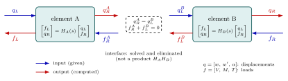
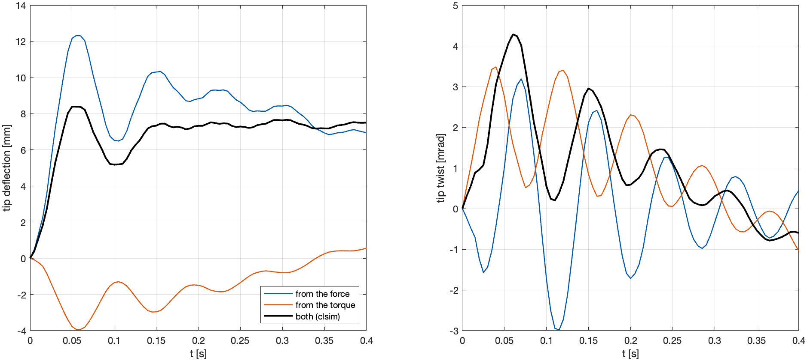

# Tutorial 12 — Building a wing from parts, and responses to several inputs

[Tutorial 11](11_continuous_wing.md) treated the Goland wing as a single
object: one characteristic function $\Delta(s,U)$, one tip transfer
function. Two questions come up as soon as one works with such a model:

1. **Can the wing be built from parts?** Real structures are assembled from
   substructures: wing segments, a store, a control surface. It is natural
   to describe each part by what it exchanges with its neighbours, its
   *ports*, and then connect the parts. For beams, this is the idea behind
   the transfer-matrix and dynamic-stiffness methods.
2. **What happens with several inputs at once?** A gust load, an aileron
   torque and a control force act together, and one wants all the
   outputs. That is a MIMO response, the analogue of `lsim` on a
   multi-input, multi-output state-space model.

This tutorial answers both. As in Tutorial 11, nothing is discretized:
every block below is the exact solution of the beam equations with exact
Theodorsen strip loads. The matrices are small (6×6, 3×3) because they
describe the **ports** of a continuous piece, not because modes were
truncated.

The complete script is `examples/continuous_wing/hybrid_quickstart.m`
(about 30 s). The study `run_hybrid_comparison.m` in the same folder
produces the figures and the validation record.

## 12.1 A strip as a two-port

Recall from Tutorial 11 that a strip of constant properties maps the
state at its left end to the state at its right end exactly:

$$\begin{bmatrix}q_R\\p_R\end{bmatrix}
=E(s)\begin{bmatrix}q_L\\p_L\end{bmatrix},\qquad
E=e^{A(s)\ell}=\begin{bmatrix}a&b\\c&d\end{bmatrix},$$

with displacements $q=[w,\,w',\,\alpha]$ and internal loads $p=[V,\,M,\,T]$.
This *transfer* form is convenient for propagation, but not for
connection. What a neighbour imposes on a strip is a displacement at one
end and a load at the other. So rewrite the same relation with **mixed
inputs**: the displacement $q_L$ at the left and the load $f_R = p_R$ at
the right are given, and the load $f_L = -p_L$ and the displacement $q_R$
are computed. Solving $p_R = c\,q_L + d\,p_L$ for $p_L$ gives

$$\begin{bmatrix}f_L\\q_R\end{bmatrix}
=H(s)\begin{bmatrix}q_L\\f_R\end{bmatrix},\qquad
H=\begin{bmatrix}d^{-1}c&-d^{-1}\\a-b\,d^{-1}c&b\,d^{-1}\end{bmatrix}.$$

Control and circuit engineers know this construction as the **hybrid
parameters** (h-parameters) of a two-port: the transistor model with
current in and voltage out at one port, and the opposite at the other.
Here each port carries three displacements and three loads. $H$ is 6×6
because the beam has six state variables, and each of its entries is a
transcendental function of $s$.



```matlab
repo = fileparts(fileparts(which('croots')));
addpath(fullfile(repo, 'examples', 'models'))
wing = wing_model('goland', 2);                   % two identical half-span strips
U = 120;  s = 3 + 70i;                            % airspeed, one complex frequency
[HA, ia] = wing_hybrid(s, U, wing.strips(1), wing.scale);
[HB, ib] = wing_hybrid(s, U, wing.strips(2), wing.scale);
assert(ia.available && ib.available)
```

## 12.2 Connecting two strips

At the junction, the two strips share their displacement, and the loads
they apply on each other balance:

$$q_R^A = q_L^B = q_I,\qquad f_R^A + f_L^B = 0.$$

These are six equations for the six interface unknowns. Substituting the
hybrid relations of $A$ and $B$ gives

$$\left(I + H^A_{22}H^B_{11}\right)q_I = H^A_{21}\,q_L - H^A_{22}H^B_{12}\,f_R,$$

and $q_I$ is then eliminated from the outputs. The result, $H^{AB}$,
describes the two strips as a single two-port, with the same kind of
inputs and outputs. **Connecting is not multiplying:** $H^A H^B$ would
feed the loads of $A$ into the displacement inputs of $B$.
`wing_hybrid_join` does the elimination. The two halves must reproduce
one strip of full length exactly:

```matlab
[H, ij] = wing_hybrid_join(HA, HB);
assert(ij.available)
Hwhole = wing_hybrid(s, U, wing_model('goland').strips, wing.scale);  % one full-span strip
fprintf('joined halves vs one strip: %.1e\n', norm(H - Hwhole, 'fro')/norm(Hwhole, 'fro'));
Ghybrid = H(4:6, 4:6);                            % clamped root (qL = 0), tip loads in
```

```text
joined halves vs one strip: 3.2e-16
```

With the root clamped ($q_L = 0$) and loads $u$ applied at the tip
($f_R = u$), the tip displacements are $q_R = H^{AB}_{22}\,u$. So
$H^{AB}_{22}$ is the 3×3 **tip transfer matrix**: tip force, bending
moment and torque in; deflection, slope and twist out.

## 12.3 The same transfer, keeping the interfaces

The second way to assemble is the one of Tutorial 11: keep the states at
every junction as unknowns and write all the equations,

$$q_0 = 0,\qquad z_1 - E_1 z_0 = 0,\qquad z_2 - E_2 z_1 = 0,\qquad p_2 = u.$$

This gives $K(s)\,x = B\,u$ and $y = C\,x$, the structured model
$G(s) = C\,K(s)^{-1}B$, which `cdyn` represents directly (see the
[matrix models reference](../api/matrix_models.md)). `ceval` evaluates
all nine channels with **one** factorization of $K$ at each frequency:

```matlab
M = wing_cdyn(U, wing);                           % K(s) x = B u,  y = C x
[Gimplicit, work] = ceval(M, s);
fprintf('hybrid vs implicit: %.1e, %d factorization for %d channels\n', ...
    norm(Ghybrid - Gimplicit, 'fro')/norm(Gimplicit, 'fro'), work.factorizations, numel(Gimplicit));
```

```text
hybrid vs implicit: 2.3e-15, 1 factorization for 9 channels
```

Both assemblies impose the same compatibility and equilibrium conditions;
they differ only in **when** the interface unknowns are eliminated. The
hybrid route eliminates them at each junction, and the implicit route
keeps them until the final solve.

## 12.4 Where the hybrid form breaks down: artificial poles

Building $H$ requires $d^{-1}$, and a connection requires
$(I + H^A_{22}H^B_{11})^{-1}$. These are the inversions of $s$-dependent
blocks that Tutorial 11 warned about. $d$ is singular exactly when the
piece alone, clamped at its left end and free at its right end, has a
mode. That is a property of the **piece**, not of the wing.

In vacuum, a half-span piece has its first such mode at
$4\times49.49 = 197.97$ rad/s. The whole wing has no mode there, as its
nearest mode is at 261 rad/s:

```matlab
dry = wing_model('dry', 2);  e = dry.strips(1);
w0 = 1.875104068711961^2*sqrt(e.EI/e.mu)/e.length^2;       % 197.97 rad/s
[~, info] = wing_hybrid(1i*w0, 0, e, dry.scale);
G = ceval(wing_cdyn(0, dry), 1i*w0);
fprintf('at %.2f rad/s: hybrid available = %d, implicit |G11| = %.2e (finite)\n', ...
    w0, info.available, abs(G(1,1)));
```

```text
at 197.97 rad/s: hybrid available = 0, implicit |G11| = 1.41e-07 (finite)
```

The hybrid matrix of the piece does not exist there, yet the wing's
transfer is perfectly finite. This is an **artificial pole** of the
representation. The functions do not regularize it: they return
`available = false`, and the transfer evaluators raise an error, so that
no wrong number is produced silently. With air, these points move off the
imaginary axis, and in the tests the two assemblies agree along the
inversion lines up to $2\times10^4$ rad/s.

Practical rules:

- **Poles and stability:** use the implicit matrix $K(s)$ and
  $\Delta = \det K$ (Tutorial 11). Never search the zeros of $\det H$: $H$
  has poles of its own that belong to no physical mode.
- **Transfer functions and responses:** both assemblies work. The hybrid
  form is modular (parts connected one at a time), while the implicit form
  never meets artificial poles. The examples use the implicit form by
  default.

## 12.5 Responses to a tip force and a tip torque together

`clsim`, `cstep`, `cimpulse` and `ckernel` also accept a **matrix model**,
built with `cmimo` (a transfer matrix) or `cdyn` (a structured model):

| Call | Input | Output |
|---|---|---|
| `clsim(M, U, t)` | `U`: one column per input | one column per output (all inputs act together) |
| `cstep(M, t)`, `cimpulse(M, t)` | — | `(time, output, input)`: one experiment per input |

`wing_response_model` wraps the tip transfer of the wing in `cmimo`. It
selects tip force and torque as inputs (in kN and kN m) and deflection
and twist as outputs (in mm and mrad). Internally it uses the adaptive
subdivision of Tutorial 11 (Section 11.6), which keeps the evaluation
accurate at the high frequencies used by the inversion.

The kernels of all four channels are prepared once with `ckernel`, as in
[Tutorial 10, Section 10.5.1](10_time_response.md#1051-several-inputs-one-preparation).
Then the combined loads, the force alone and the torque alone are three
cheap `clsim` calls:

```matlab
P = wing_response_model(U, wing, 'implicit', [1 3]);   % force/torque -> w/alpha
t = (0:0.005:0.4).';
loads = [1 + 0.2*sin(10*t), 0.3*cos(5*t)];
bank = ckernel(P, t, 'SingularityBound', 5, 'AbsTol', 1e-3, 'RelTol', 1e-3);
out = {'AbsTol', [0.01 0.01], 'RelTol', 2e-3};    % 10 micrometres, 10 microradians
[y, ~, info] = clsim(bank, loads, t, out{:});
yForce  = clsim(bank, [loads(:,1) 0*t], t, out{:});
yTorque = clsim(bank, [0*t loads(:,2)], t, out{:});
assert(info.converged && info.evaluations == 0)
fprintf('superposition residual: %.1e\n', max(abs(y - yForce - yTorque), [], 'all'));
```

```text
superposition residual: 8.9e-16
```



The figure shows what a MIMO response is made of, and how strongly this
wing couples bending and torsion. The force (blue) bends the wing, and it
also twists it about as much as the torque does (right panel). The torque
(orange) twists the wing, and it also pulls the tip **up**, by up to
4 mm, partly cancelling the deflection due to the force (left panel). The
coupling comes from inertia (the centre of mass lies behind the elastic
axis) and from the air loads. The black curve, the response to both
loads, is exactly the sum of the two contributions. A single-input
analysis would show only one colour in each panel and miss these
cross-effects. Preparing the bank takes about
30 s; each of the three simulations then takes a few milliseconds and
evaluates the wing model **zero** times (`info.evaluations == 0`).

`SingularityBound = 5` is, as in Tutorial 11, an assumption. It is
supported by the root counts (no unstable root at 120 m/s) but not proved
by them.

## 12.6 Accuracy of a MIMO response

Each output is a **sum of channel contributions**, and so is its error.
`clsim` adds the estimated errors of all the channels that feed an output
and compares the total with that output's tolerance,
`AbsTol(i) + RelTol*|y_i|`. Two consequences:

- **Give one `AbsTol` per output, in its own units.** Here `[0.01 0.01]`
  means 10 µm of deflection and 10 µrad of twist. A single number would
  mix millimetres and milliradians.
- **Cancellation is visible.** If two large contributions nearly cancel,
  the sum is small but its error is not, and the output is reported as
  unresolved instead of silently accepted.

A bank holds every channel, including those whose input is zero in the
first simulation, so any later combination of loads works. As with the
scalar `ckernel`, reuse never refines the kernels: prepare a new bank if
tighter output tolerances are needed.

## 12.7 How the results are checked

| Check | Result |
|---|---|
| two joined half-span strips vs one full-span strip | $3\times10^{-16}$ |
| hybrid vs implicit tip transfer, all 9 channels; dry, Goland and tapered wings; 1/2/4/8 strips; 5 complex frequencies | $\le 1.6\times10^{-13}$ |
| hybrid vs implicit, along $\mathrm{Re}\,s = 6$ up to $2\times10^4$ rad/s | $\le 1.6\times10^{-9}$, no pivot failure |
| `cdyn` vs the scalar `wing_transfer` of Tutorial 11, 9 channels | $2\times10^{-14}$ |
| time responses, hybrid vs implicit banks (force + torque) | $5\times10^{-14}$ mm, $3\times10^{-14}$ mrad |
| matrix bank vs sum of independent scalar `clsim` calls | $3.3\times10^{-4}$ mm (tolerance $10^{-2}$) |
| 2×2 rational model with a different delay per channel vs MATLAB `lsim` (ZOH) | $1.4\times10^{-9}$ |
| superposition, both loads vs sum of single loads | $9\times10^{-16}$ |

The agreement between the two assemblies shows that they represent the
same model. It does not validate the physics again: the physical
references (closed-form frequencies, finite elements, modal series) are
those of Tutorial 11. The recorded run is in
[HYBRID_VALIDATION.md](../../examples/continuous_wing/HYBRID_VALIDATION.md).

<!-- no-test -->
```matlab
addpath(fullfile(repo, 'examples', 'continuous_wing'))
results = run_hybrid_comparison;   % about 2 min; writes output/hybrid_comparison/
```

## 12.8 Scope

- **What is new.** Matrix models (`cmimo`, `cdyn`, `ceval`, `cchannel`) and
  MIMO zero-state responses with reusable kernel banks. See the
  [matrix models](../api/matrix_models.md) and
  [MIMO responses](../api/matrix_responses.md) references.
- **What is not.** Pole and zero searches remain scalar. There is no
  `cmodes`, no MIMO transfer poles and no transmission zeros. For the
  modes of a matrix problem, use $\det K$ as in Tutorial 11.
- **The hybrid connector** (`wing_hybrid`, `wing_hybrid_join`) is an
  example for a chain of beam strips, not a general network assembler.
- As everywhere in the toolbox, responses start from rest, and the
  inversion domain is your assumption.
