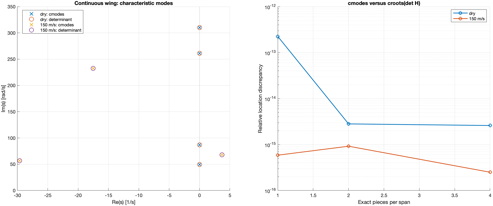
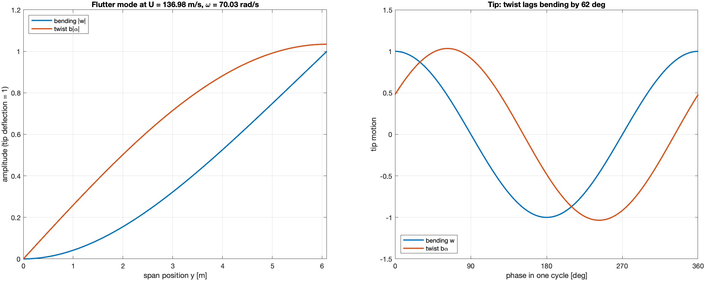

# Tutorial 13 — Modes of a matrix, without a determinant

In [Tutorial 11](11_continuous_wing.md) the modes of the continuous wing
were the zeros of a scalar function, $\Delta(s,U) = \det K(s,U)$. That works,
and it is what every tutorial before this one did for matrix problems:
write the determinant and give it to `croots`. `cmodes` searches the
matrix $K(s)$ **itself**. It adds three things:

1. **No overflow or underflow.** A determinant multiplies $n$ numbers. If
   each is $10^{200}$, the product is `Inf` in floating point, although
   the matrix is perfectly representable. `cmodes` never forms that
   product.
2. **The mode shapes.** At each mode it also returns the null vector,
   $K(\lambda)v = 0$. For the wing, this gives the exact, continuous shape
   of the flutter mode (Section 13.6).
3. **An honest multiplicity.** It distinguishes two independent modes at
   the same place from a single *defective* one, and it says so when it
   cannot decide.

As before, nothing is approximated: $K(s)$ may contain exponentials,
Bessel functions or matrix exponentials. The functions used here need no
additional toolbox.

## 13.1 The modes of a matrix

A **characteristic value**, or mode, of a square matrix function $H(s)$ is
a point $\lambda$ where $H(\lambda)$ is singular, so that
$H(\lambda)\,v = 0$ for some nonzero vector $v$. For $H(s) = sI - A$ these
are the eigenvalues of $A$. For a delay system
$H(s) = sI - A_0 - A_1e^{-sT}$ they are its characteristic roots. For the
wing they are its aeroelastic modes.

```matlab
H = @(s) [s+1, 0.2*exp(-s); 0, s+2];
box = [-3 0 -1 1];
[r, info] = cmodes(H, box, 'AssumeAnalytic', true);
fprintf('modes: %s (%s)\n', mat2str(real(r).', 4), info.status);
v = info.rightVectors{1};
fprintf('|H(r1) v| = %.1e\n', norm(H(r(1))*v));
```

```text
modes: [-1 -2] (numerically_complete)
|H(r1) v| = 4.0e-46
```

The call looks like `croots`: a function, a rectangle
`[xmin xmax ymin ymax]`, and the assertion `'AssumeAnalytic',true`. Here
the assertion means that $H$ is analytic in the rectangle and not singular
everywhere. `info.rightVectors{k}` and `info.leftVectors{k}` hold the
null vectors, $H(\lambda_k)v = 0$ and $w^*H(\lambda_k) = 0$.

## 13.2 Modes of H are not always poles of the transfer

A structured model $H(s)x = B u$, $y = Cx$ has the transfer
$G = C H^{-1} B$. Every pole of $G$ is a mode of $H$, but not every mode of
$H$ shows up in $G$. An input may not excite a mode, or an output may not
see it. `cmodes` accepts a `cdyn` model and searches its $H$:

```matlab
M = cdyn(H, [1; 0], [1 0], 0, 'Dimensions', [2 1 1]);
modes = cmodes(M, box, 'AssumeAnalytic', true);
G = @(s) squeeze(ceval(M, s));
fprintf('%d modes; G(0) = %.4f = 1/(0+1): no pole at -2\n', numel(modes), G(0));
```

```text
2 modes; G(0) = 1.0000 = 1/(0+1): no pole at -2
```

$H$ has modes at $-1$ and $-2$, but $G(s) = 1/(s+1)$. The mode at $-2$ is
**hidden**, the transcendental analogue of an uncontrollable or
unobservable mode of a state-space model. `cmodes` returns the internal
modes; it does not decide which of them are visible.

## 13.3 Why no determinant is needed

The argument principle counts the zeros of $\det H$ inside a closed
curve $\Gamma$ from the change of its phase. By Jacobi's formula this is
also

$$N = \frac{1}{2\pi i}\oint_\Gamma \operatorname{tr}\!\left(H^{-1}H'\right)ds
    = \frac{1}{2\pi}\,\Delta_\Gamma \arg\det H .$$

The phase of $\det H$ can be obtained without the determinant. An LU
factorization $PH = LU$ gives $\det H = \pm\prod_j U_{jj}$, so
$\arg\det H = \sum_j \arg U_{jj}$, plus $\pi$ if the permutation is odd.
`cmodes` adds the phases and the logarithms of the magnitudes of the
pivots, and never multiplies them. The count therefore works even when the
product would overflow:

```matlab
Hbig = @(s) diag([1e200*(s+1), 1e200*(s+2)]);
[rb, ib] = cmodes(Hbig, box, 'AssumeAnalytic', true);
[rd, id] = croots(@(s) arrayfun(@(z) det(Hbig(z)), s), box, 'AssumeAnalytic', true, 'Warn', false);
fprintf('det(Hbig(-0.5)) = %g\n', det(Hbig(-0.5)));
fprintf('cmodes: %s (%s); croots(det): %d roots (%s)\n', mat2str(sort(real(rb)).'), ib.status, numel(rd), id.status);
```

```text
det(Hbig(-0.5)) = Inf
cmodes: [-2 -1] (numerically_complete); croots(det): 0 roots (unresolved)
```

The determinant route fails honestly (`unresolved`, not "no roots"). The
matrix route finds both modes. `cmodes` also rescales rows and columns
once, at a reference point, with fixed diagonal factors that do not move
the modes. What it cannot repair is information already lost inside the
function, such as a matrix whose entries themselves overflow.

The rest of the search is the one of Tutorial 4: rectangles are divided
until each contains a known number of modes, each mode is refined by a
Newton iteration, and it is accepted only when a small contour around it
counts the expected number. As with `croots`, a mode on the border of the
rectangle leaves the search unresolved.

## 13.4 Two modes at the same place

A count of 2 in a tiny square can mean two different things:

```matlab
[a, ia] = cmodes(@(s) (s+1)*eye(2), [-2 0 -1 1], 'AssumeAnalytic', true);
[b, ib2] = cmodes(@(s) [s+1 1; 0 s+1], [-2 0 -1 1], 'AssumeAnalytic', true, 'Warn', false);
fprintf('(s+1)I:        count %d, nullity %d, multiplicity %d, %s\n', ia.count, ia.nullity, ia.multiplicity, ia.status);
fprintf('[s+1 1;0 s+1]: count %d, nullity %d, multiplicity %g, %s\n', ib2.count, ib2.nullity, ib2.multiplicity, ib2.status);
```

```text
(s+1)I:        count 2, nullity 2, multiplicity 2, numerically_complete
[s+1 1;0 s+1]: count 2, nullity 1, multiplicity NaN, unresolved
```

For $(s+1)I$ there are **two independent directions** $v$ at $-1$ (nullity
2): a genuine double mode. For the second matrix, a Jordan block, there is
only one direction although the count is two: the mode is *defective*.
`cmodes` counts it correctly (`count` = 2) but does not attempt the Jordan
structure. It reports `multiplicity` = NaN and marks the result
`unresolved`, rather than inventing a simple mode. Two very close but
distinct modes can be reported the same way. Read `localCounts`,
`nullity` and `multiplicity` together.

The number of modes is not limited by the size of the matrix: the 1×1
matrix $\sinh s$ has seven modes in $[-1,1]\times[-10,10]$, and
`diag(sin(s),1)` has four in $[-0.4,10]\times[-1,1]$.

## 13.5 The wing, from its matrix

The implicit matrix $K(s,U)$ of Tutorial 11 is analytic away from the
Theodorsen branch cut, so `cmodes` can search it directly. For example,
the stability count at 150 m/s of Tutorial 11, Section 11.4:

```matlab
repo = fileparts(fileparts(which('croots')));
addpath(fullfile(repo, 'examples', 'models'))
wing = wing_model('goland');
K = @(U) @(s) full(wing_matrix(s, U, wing));
[rw, iw] = cmodes(K(150), [1e-3 60 -400 400], 'AssumeAnalytic', true);
fprintf('150 m/s: %d unstable modes, %s\n', numel(rw), mat2str(rw.', 5));
```

```text
150 m/s: 2 unstable modes, [3.6974-68.184i 3.6974+68.184i]
```

This is the same pair as with $\det K$. Two rules carry over from
Tutorials 11 and 12:

- **Search the implicit matrix $K$, never the hybrid matrix $H$** of
  Tutorial 12. $H$ has artificial poles and is not analytic.
- **Keep the matrix size fixed during a search.** `wing_matrix(s,U,wing,pieces)`
  with a fixed number of pieces is fine. The frequency-adaptive
  subdivision used for time responses would change the size of $K$ with
  $s$, so it is not allowed here. At the frequencies of a mode search
  (a few hundred rad/s) one piece per strip is enough.



The study `run_matrix_modes_comparison` compares the two routes for the dry
wing and at 150 m/s, with 1, 2 and 4 exact pieces. They agree to
$10^{-13}$ or better, and the dry modes match the closed-form cantilever
frequencies to $2\times10^{-13}$ (one piece) and $6\times10^{-16}$ (two
pieces).

## 13.6 The flutter mode shape

The null vector returned by `cmodes` contains the state
$z = [w, w', \alpha, V, M, T]$ at every node of $K$, and in particular at
the root. Propagating the root state with the exact strip propagator gives
the mode shape **at every point of the span**, again without any
discretization. `wing_mode_shape` does this:

```matlab
Uf = 136.983977449;                               % flutter speed, Tutorial 11
[lf, jf] = cmodes(K(Uf), [-2 2 60 80], 'AssumeAnalytic', true);
y = linspace(0, wing.L, 121);
[w, alpha] = wing_mode_shape(lf, Uf, wing, jf.rightVectors{1}, y);
b = wing.strips(1).b;  ratio = b*alpha(end)/w(end);
fprintf('flutter mode %.4f%+.4fi: tip b*alpha/w = %.3f, twist lags bending by %.0f deg\n', ...
    real(lf), imag(lf), abs(ratio), -angle(ratio)*180/pi);
figure, plot(y, abs(w)/abs(w(end)), y, abs(b*alpha)/abs(w(end))), grid on
xlabel('span position y [m]'), legend('bending |w|', 'twist b|\alpha|')
```

```text
flutter mode -0.0000+70.0330i: tip b*alpha/w = 1.034, twist lags bending by 62 deg
```



At the flutter speed the mode sits on the imaginary axis, at 70.03 rad/s.
Its shape is the physics of flutter:

- the bending deflection $w(y)$ starts with zero slope at the clamped
  root, like a cantilever;
- the twist $\alpha(y)$ grows from zero, and at the tip it is as large as
  the bending motion ($b\,|\alpha| \approx 1.03\,|w|$);
- the twist lags the bending by about 62° (right panel). This phase
  difference lets the air do net work on the wing over each cycle, and it
  is the mechanism of bending–torsion flutter. With bending and twist in
  phase, that work would vanish.

The shape is complex because the parts of the wing do not move in phase:
bending and twist reach their maxima at different instants. A
finite-element model would give an approximation of this curve on its
mesh. Here it is the exact solution of the beam equations, for this
$\lambda$.

## 13.7 Reading an incomplete result

Check, in this order:

1. `countComplete`: was the total number of modes in the rectangle
   determined? If not, look at `stopReason`. Usual causes are a mode on
   the border, an exhausted budget, or a function that is not analytic
   there.
2. `complete`: are all locations and multiplicities resolved? If
   `countComplete` is true but `complete` is false, look at `clusters`,
   which hold defective or very close modes.
3. `unresolvedBoxes`: parts of the rectangle where the search gave up.

`count = 0` means "no modes" only when `countComplete` is true. An
unresolved search is never reported as an empty spectrum.

## 13.8 How the results are checked

| Check | Result |
|---|---|
| modes of `diag(s+1+0.5e^{-s}, s+2)` vs Lambert W, 9 modes | $4\times10^{-16}$ |
| `diag(sin s, 1)`: four modes in a 2×2 matrix | 0, π, 2π, 3π |
| $(s+1)I$ vs Jordan block | multiplicity 2 vs defective, unresolved |
| scaling $10^{\pm200}$: `cmodes` complete, `croots(det)` unresolved | as expected |
| dry wing vs closed-form cantilever frequencies | $\le 2\times10^{-13}$ |
| wing, `cmodes` vs `croots(det K)`, dry and 150 m/s, 1/2/4 pieces | $\le 2.3\times10^{-13}$ |
| flutter mode: free-tip loads of the propagated shape | $5\times10^{-14}$ relative |
| flutter mode shape with 1 and 2 pieces | identical ratio and phase |

The unit tests (`test_matrix_modes`, `test_matrix_modes_wing`) also cover
permutation signs, the trace-integral cross-check with a supplied
derivative, hidden modes, domain guards, borders and budgets. The recorded
comparison is in
[MATRIX_MODES_VALIDATION.md](../../examples/continuous_wing/MATRIX_MODES_VALIDATION.md).

<!-- no-test -->
```matlab
addpath(fullfile(repo, 'examples', 'continuous_wing'))
results = run_matrix_modes_comparison;   % about 30 s; writes output/matrix_modes/
```

## 13.9 Scope

- `cmodes` finds the characteristic values of an **analytic** square
  matrix: the internal modes. It does not find MIMO transfer poles, and it
  does not find transmission zeros.
- Defective modes are counted but not resolved; no Jordan chains or
  partial multiplicities are computed.
- The engine is dense (LU and SVD at every sample), intended for small and
  moderate matrices such as the wing's 12×12 to 30×30.
- Completeness is numerical and conditional on analyticity, as for
  `croots`; `info.certified` is always false.

See the [`cmodes` reference](../api/cmodes.md) for all options and fields.
